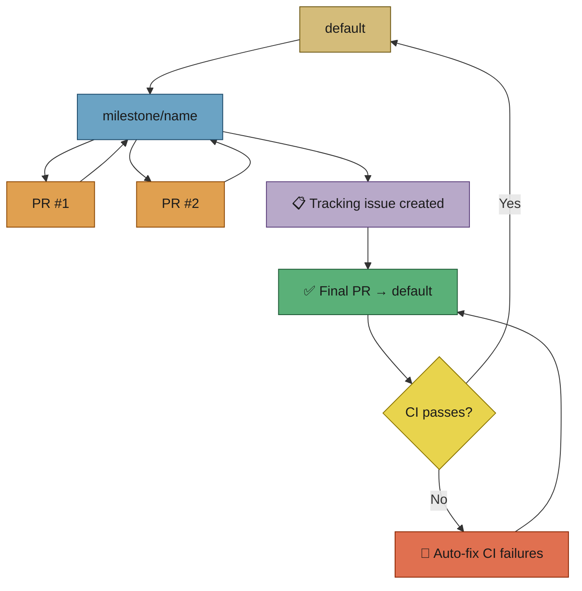
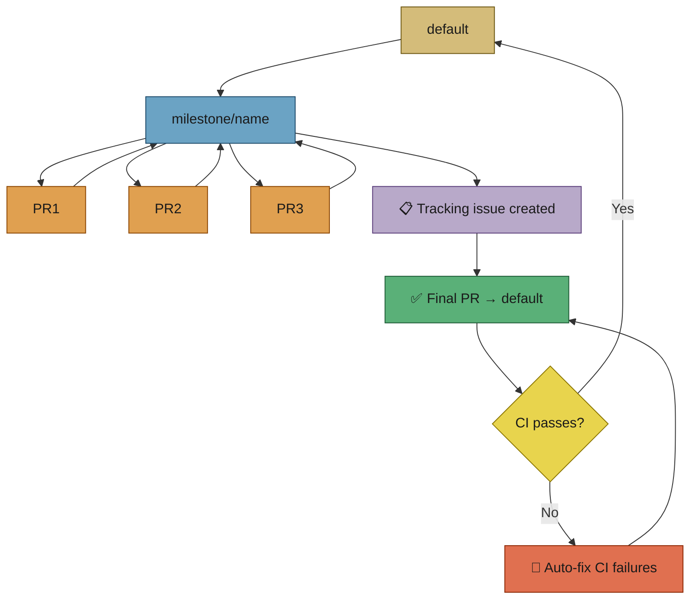
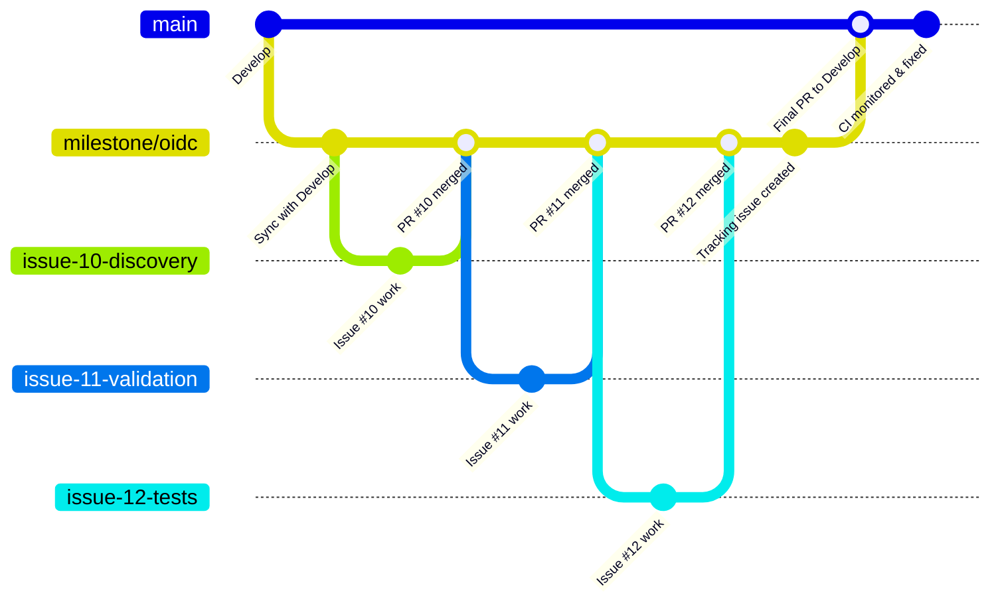

# 🎯 Workflow: Milestones

This page is part of the **user manual** for the Vibe Coder. It describes how milestones work: grouping issues into a shared branch, **one PR per target branch**, and the final PR from the milestone branch to default when all milestone issues are done. For internal details, see **Further reading** at the end.

---

## Why milestones? (Productivity + safety)

**Milestones unlock the potential** of the Vibe Coder: it can **safely** work on many issues in the background overnight or over the weekend. Each milestone-issue PR targets the **milestone branch**, and the worker **enables auto-merge at PR creation** for those PRs like any other (Issue #1136). The Priority 1.65 catch-up scan — and the post-scan sweep that repeats it once the issue slots drain — are the backstop when arming is refused or fails. You still get **one final PR** to default with many issues completed and quality checks already exercised on the milestone line.

**Safety is unchanged.** Every PR (including every milestone-issue PR) runs the full quality gate (e.g. `./quality.sh`). **No code reaches the default branch without your review:** the only path to default is the **final PR** from the milestone branch, which you approve when ready. Productivity gain without sacrificing oversight.

**One issue at a time (no milestone):** Each PR targets the default branch. The Vibe Coder **stops and waits** for a human to review and approve before it can pick the next issue. The backlog doesn’t move until you merge.

---

## ⚡ TL;DR

**One branch per milestone; one PR (Pull Request) at a time per branch.** Put issues in a GitHub milestone → the worker creates a `milestone/<name>` branch and implements issues one by one, each with a PR **to the milestone branch** (not default). Those PRs enable auto-merge at create, exactly as non-milestone PRs do (Issue #1136); the Priority 1.65 catch-up path and the post-scan sweep are the backstop — see [Label Flows](label-flows.md) and [PR feedback](pr-feedback.md). When **all** milestone issues are done, the worker creates a **tracking issue**, then opens **one final PR** from the milestone branch to default — the human review gate for the whole stream. The worker **monitors the final PR for CI failures** (including integration tests that may only run against the default branch) and automatically fixes them. Milestone issues **branch off the milestone branch** so the integration line stays clean. Spelling/quality/merge fixes run automatically on worker-authored PRs.



---

## 🎯 Purpose and scope

- **Purpose:** Define how the worker handles issues that belong to a GitHub milestone: create/sync `milestone/<name>` branch, implement issues one at a time with PRs targeting that branch, and create a final PR from the milestone branch to the default branch when all milestone issues are closed.
- **Scope:** Milestone branch creation and sync; issue selection with milestone-aware open-PR blocking; PR targeting milestone branch (uses "Closes #N" — see [Issue closure for milestone issues](#issue-closure-for-milestone-issues)); milestone completion detection; final consolidation PR; closing the GitHub milestone after merge.

## 🔀 One PR per target branch

In a single repo, issues either target the **default branch** (no milestone) or a **milestone branch**. The worker creates **at most one open PR per target branch**:

- **No milestone** — At most one PR targeting the default branch (for issues with no milestone).
- **Per milestone** — At most one PR targeting that milestone’s branch (for issues in that milestone).

So: if there are issues with no milestone and issues in one milestone, there can be **up to 2 PRs** (one to default, one to the milestone branch). With more milestones, more concurrent PRs (one per milestone plus one to default). See [projects-and-dependencies.md](projects-and-dependencies.md) for the full model.

**Enforced at issue selection:** When selecting an issue for implementation, the worker skips any issue whose target branch already has an open PR by the configured GitHub user. This is enforced at **issue selection** time — the issue finder filters out blocked issues before one is chosen. Issues with `ignore-open-prs` (added by an allowed author) bypass this check. See [resilience-and-concurrency.md](resilience-and-concurrency.md#one-pr-per-target-branch-open-pr-blocking).

**Implementation only:** This constraint applies only to **implementation** workflows (issues selected via `find_oldest_issue`). Planning, question, and refinement workflows are **exempt** — they never create branches or PRs, so open-PR blocking is irrelevant. See [planning-and-questions.md](planning-and-questions.md#open-pr-blocking-does-not-apply-issue-500).

## 🔍 Milestone-aware repo availability

When scanning for work, the worker checks each repo for **available work streams** rather than simply checking whether any issue is assigned. A work stream is either a specific milestone or the non-milestone (default branch) stream.

**Design principle:** A PR targeting the default branch must not block issues in milestones. Milestones are independent work streams. A repo is only fully "busy" when **every** work stream has assigned work.

This means: if a non-milestone issue has a stuck PR targeting the default branch, milestone issues in the same repo **remain eligible**. The worker will scan the repo and find the milestone work.

**Implementation:** The `check-repo-availability` Deno command (`worker/deno/lib/repo_availability.ts`) groups open issues by work stream (milestone title) and checks assignment status per stream. It replaces the previous coarse `is_repo_busy()` shell function which treated any assigned issue as blocking the entire repo.

## 🎭 Actors and triggers

- **Trigger (per issue):** Issue has a milestone set and is selected for implementation (same eligibility as non-milestone issues, plus milestone-aware blocking: do not start another issue for the same milestone while this worker already has an open PR targeting that milestone branch).
- **Trigger (completion):** **All** issues in the milestone are completed (closed); worker creates the **final PR** from `milestone/<name>` to the default branch.

## 📏 Preconditions / invariants

- **One issue per milestone at a time:** The worker enforces that **only one issue per repo/milestone combination** can be in progress simultaneously. The `is_milestone_occupied` check in the issue finder ensures that if any issue in the same repo and milestone is already assigned, no additional issues from that milestone are eligible. This prevents concurrent work on different milestone issues — ensuring each issue builds on the completed work from the previous one. This applies to both milestone and non-milestone issues (one non-milestone issue per repo at a time).
- **One PR (Pull Request) per target branch:** The worker does not start a second implementation issue for the same target branch (default or a given milestone) while there is already an open PR by the configured GitHub user targeting that branch. Enforced by **issue selection**: the issue finder does not return an issue whose target branch already has an open PR by that user.
- **Milestone issues branch off the milestone branch:** When implementing an issue that has a milestone, the feature branch is created from the **milestone branch** (created/synced if needed), not from the default branch. PR targets the milestone branch.
- **Parallel target branches:** Different target branches (default vs milestone A vs milestone B) can each have one PR in progress. No separate lock object — implemented via selection filtering.

## ✅ Happy path

### 📌 Per-issue (milestone issue)

1. **Select** — Issue is in a milestone; no other open PR by the configured GitHub user for **this milestone branch**; issue is otherwise eligible (labels, author, not blocked by dependencies or open children).
2. **Branch** — Ensure `milestone/<name>` exists (from default); sync it with default (merge); **create feature branch from the milestone branch** (not from default).
3. **Implement** — Same as non-milestone: clarify if needed, Claude, quality, commit, push.
4. **PR** — Create PR targeting **milestone branch** (not default). Use "Closes #N" in the PR body (not "Addresses #N" — see [Issue closure for milestone issues](#issue-closure-for-milestone-issues)). Enable auto-merge at create, like any other PR (Issue #1136); the catch-up scan and post-scan sweep are the backstop.

### ✅ Milestone completion

Once **all** issues for a milestone are completed (merged to the milestone branch or closed), the worker creates a tracking issue and raises a PR targeting the default branch:

1. **Detect** — All issues in the milestone are closed.
2. **Tracking issue** — A GitHub issue titled "Merge milestone '&lt;name&gt;' to &lt;default&gt;" is created. This provides a visible record of the milestone completion and is automatically closed when the final PR merges. The tracking issue lists all closed milestone issues and is labelled with the first configured issue label for automatic discovery.
3. **Final PR** — Create a single pull request from `milestone/<name>` to the **default** branch; body lists addressed issues and includes a `Closes #N` reference to the tracking issue. Resolve any merge issues, then enable auto-merge (see [pr-feedback.md](pr-feedback.md): auto-merge only when the PR is mergeable).
4. **CI (Continuous Integration) monitoring** — The final PR is monitored for CI/integration test failures. This is particularly important because **repositories that only run integration tests on the default branch** will have those tests exercised for the first time against the milestone's combined changes. The worker automatically detects and fixes CI failures at priority 1.55 in the main loop — see [CI/integration test failure detection](#ciintegration-test-failure-monitoring).
5. **After merge** — Close the GitHub milestone (when the final PR is merged).

This final PR is monitored like all other PRs **authored by the configured GitHub user** (see [pr-feedback.md](pr-feedback.md)): spelling, quality (shellcheck, Deno quality checks), CI/integration test failures, and merge issues are fixed automatically; auto-merge is enabled once the PR is mergeable.

## 🔒 Issue closure for milestone issues

GitHub auto-closes issues only when a PR containing a closing keyword ("Closes #N", "Fixes #N", "Resolves #N") is merged into the **default branch**. Merging into any other branch — including a milestone branch — does **not** auto-close the referenced issue, regardless of keywords used.

### 💡 Why "Closes" and not "Addresses"

Milestone PRs use **"Closes #N"** (not "Addresses #N") even though GitHub will not auto-close the issue when the PR merges into the milestone branch. This is intentional:

- **"Addresses"** is not a GitHub closing keyword. When milestone PRs used "Addresses", the `ensure_pr_references_issue` safety net would not detect a valid closing reference, causing the worker to repeatedly pick up the same issue in an infinite loop.
- **"Closes"** satisfies the closing-keyword validation and links the PR to the issue on GitHub, but does **not** trigger auto-close because the target branch is not the default branch.

### 🕐 When milestone issues actually close

Milestone issues are closed **manually** — either by the user or by the worker via `close_milestone_issue_after_merge()` — after their individual PR is merged into the milestone branch. They are **not** auto-closed by GitHub because the PR targets a non-default branch.

The milestone completion check (`check_and_handle_milestone_completions()`) only creates the final consolidation PR once **all** milestone issues are closed. This means:

1. Each individual milestone PR merges into the milestone branch → the issue stays open (GitHub does not auto-close).
2. The issue is closed manually or by the worker after the merge.
3. Once all issues are closed, the worker detects completion and creates the final PR from `milestone/<name>` to the default branch.
4. After the final PR is merged, the GitHub milestone itself is closed.

## 📊 Diagram: milestone branch flow



## 📊 Diagram: milestone branch flow (gitGraph)

The following `gitGraph` diagram shows how milestone issues branch off a shared milestone branch, merge back one at a time, and then — after a tracking issue is created and CI is monitored — a final consolidation PR merges the milestone branch into `Develop`:



*The `main` line represents `Develop`. Each milestone issue branches from `milestone/<name>`, merges back via PR (one at a time). When all issues are done, a tracking issue is created, the milestone branch merges into `Develop` with a consolidation PR, and the worker monitors CI — automatically fixing any failures (including integration tests that may run for the first time against the default branch).*

## 🔧 CI/integration test failure monitoring

The milestone summary PR (final PR from `milestone/<name>` to default) is monitored for CI and integration test failures, just like any other PR authored by the worker. This is particularly important for milestones because:

- **Integration tests on the default branch:** Some repositories only run integration tests when targeting the default branch. The milestone summary PR is the first time the combined milestone changes are tested against the default branch's CI pipeline.
- **Automatic detection:** `find_failed_ci_checks` scans all open PRs for failed check runs (excluding spelling checks, which are handled separately at priority 1.5). PRs targeting the default branch are prioritised.
- **Automatic remediation:** `work_on_ci_failure` diagnoses and fixes CI failures using Claude, then commits and pushes the fix to the PR branch. Retries are capped at `CI_CHECK_MAX_RETRIES` (default 3) per check run.
- **Priority 1.55:** CI failure remediation runs after spelling fixes (1.5) but before branch updates (1.6), ensuring CI issues on the milestone summary PR are addressed promptly.

If a CI failure cannot be fixed after the maximum number of retries, a comment is posted on the PR and the failure is left for manual investigation.

## 🔄 Periodic milestone branch sync

Long-running milestones can drift significantly from the default branch, causing merge conflicts when the final summary PR is created. To prevent this, the worker periodically merges the default branch into active milestone branches at **priority 1.72** in the main event loop — after milestone completion checks (1.7) but before issue refinement (1.75).

### How it works

1. **Active milestone detection:** For each configured repo, the worker finds open milestones with at least one closed issue (meaning work has started).
2. **Branch existence check:** Verifies the milestone branch exists on the remote before attempting sync.
3. **Merge:** Merges the default branch into the milestone branch using `git merge --no-edit`. If the merge succeeds cleanly, pushes the result.
4. **Conflict handling:** If a merge conflict occurs, the worker attempts auto-resolution (favouring default branch changes). A **modify/delete** conflict — the milestone branch edited a file the default branch deleted — resolves as a **delete**, never by keeping the file (Issue #1048). If auto-resolution fails, the conflict is logged as a warning without blocking other work.
5. **Frequency guard:** Each milestone is synced at most once per cooldown period (default: 1 hour). The cooldown resets after each successful sync.
6. **Gated branches:** Where a ruleset refuses the direct push, the same merge lands through a `sync/milestone-<name>` PR (Issue #589). That PR merges as a **merge commit, never a squash** (Issue #1048) — see below.

### The sync must record the default branch as an ancestor

A squashed sync applies the default branch's *content* under a single-parent
commit, so the default branch is **not an ancestor** of the milestone branch.
Every later merge then computes its merge base from before the sync, and a
deletion the default branch made in the meantime returns as a modify/delete
conflict instead of a deletion. On `milestone/863` that revived 1984 lines of a
deliberately-removed subsystem, and it surfaced only because the resurrected
test tripped an unrelated gate.

```mermaid
gitGraph
    commit id: "shared base"
    branch milestone/863
    checkout main
    commit id: "delete subsystem"
    checkout milestone/863
    merge main id: "sync (merge commit)"
    commit id: "milestone work"
    checkout main
    commit id: "more main work"
    checkout milestone/863
    merge main id: "later merge — deletion is history"
```

Two things hold this in place:

- **The sync PR merges as a merge commit.** `mergeMethodFlagForHead` in
  `worker/deno/lib/milestone_sync_pr.ts` returns `--merge` for a
  `sync/milestone-*` head and `--squash` for everything else, and every
  auto-merge and direct-merge path routes through it. This needs **merge
  commits to be permitted on the repository** (Settings → Pull Requests →
  Allow merge commits). Where they are not, the sync is armed as a squash with
  a warning naming the setting, and the check below is what catches the
  consequence.
- **A resurrection is detected directly.** The `check-resurrected-files`
  command fails when a branch carries a file the default branch deleted and
  whose deleting commit is already in the branch's ancestry:

  ```bash
  deno run --allow-read --allow-env --allow-run worker/deno/mod.ts \
    check-resurrected-files --repo-dir . --branch HEAD --default-branch origin/main
  ```

  The `milestone-resurrection` job in `.github/workflows/validate-scripts.yml`
  runs it on every PR into a `milestone/*` branch and on the milestone →
  default-branch rollup PR, naming each file and the commit that deleted it.
  A file that is new on the milestone branch and was never on the default
  branch is not reported, and neither is a branch that is merely behind the
  deletion — only a branch that has the deleting commit in its ancestry and
  the file still in its tree.

### Configuration

| Option | Default | Description |
|--------|---------|-------------|
| `sync_milestone_branches` | `true` | Enable or disable periodic milestone branch sync |
| `milestone_sync_cooldown_seconds` | `3600` | Minimum seconds between sync attempts for the same milestone |

To disable milestone branch sync entirely, set `sync_milestone_branches: false` in `.config.json`.

### Design notes

- The sync is **best-effort** — failures are logged but do not block the main event loop or prevent other work.
- The cooldown state is held in memory and resets when the worker process restarts.
- This complements (syncing before each feature branch creation) by proactively keeping milestone branches current between issues.

## 🏷️ Issue ordering within milestones

By default, issues within a milestone are processed oldest-first (by creation date). You can override this order using **priority labels** to control which milestone issue the worker picks next.

These `priority-high`/`priority-low` labels order issues **within a single milestone only**; they are independent of the cross-repo discovery tiers (`top-priority` > `work-on` > `low-priority` > `idle-task`) that decide which issue is picked across the whole queue. The discovery tiers are the canonical reference — see [Issue selection priority](issue-processing.md#-issue-selection-priority).

### Priority labels

| Label | Effect |
|-------|--------|
| `priority-high` | Issue is selected before normal and low-priority issues in the same milestone |
| *(no label)* | Default — normal priority; selected by creation date |
| `priority-low` | Issue is selected after normal and high-priority issues in the same milestone |

### How it works

1. **Within the same milestone:** Issues with `priority-high` are picked first, then normal (no label), then `priority-low`. Within the same priority level, oldest-first applies.
2. **Across milestones:** Priority labels have no effect. Cross-milestone selection remains globally oldest-first.
3. **Non-milestone issues:** Priority labels have no effect on issues without a milestone.
4. **Fallback:** When no priority labels are present, the existing oldest-first behaviour is preserved.

### Example

A milestone "v2.0" has three issues:

| Issue | Created | Label | Selected |
|-------|---------|-------|----------|
| #10 — Add feature X | Jan 1 | — | 2nd |
| #11 — Database schema migration | Feb 1 | `priority-high` | **1st** |
| #12 — Nice-to-have cleanup | Mar 1 | `priority-low` | 3rd |

Without priority labels, #10 would be picked first (oldest). With the `priority-high` label on #11, the worker picks the database migration first — ensuring the schema is in place before dependent features.

### Implementation

Priority extraction is implemented in `worker/deno/lib/milestone_priority.ts`. The `extractMilestonePriority()` function reads priority labels from each issue and assigns a numeric value used during candidate sorting in `worker/deno/lib/issue_priority.ts`.

## 🔀 Decision points and exceptions

- **Milestone branch sync conflict:** Merge from default into milestone fails; worker logs and aborts; user may need to resolve on milestone branch manually.
- **Final PR already exists:** Worker should not create a duplicate; ensure idempotent behaviour (create or update/find existing).
- **Milestone closed on GitHub:** Worker should not pick new issues from closed milestones; in-progress work on already-claimed issues may complete.

## 📚 Further reading

- **Internals:** [Worker Internals](../INTERNALS.md) — run loop, issue selection, PR monitoring, milestone/dependency handling.
- **Implementation details:** [worker/deno/lib/run_core.ts](../../worker/deno/lib/run_core.ts), [worker/deno/lib/issue_worker.ts](../../worker/deno/lib/issue_worker.ts), [worker/deno/lib/issue_finder.ts](../../worker/deno/lib/issue_finder.ts), [worker/deno/lib/issue_filter.ts](../../worker/deno/lib/issue_filter.ts) (milestone occupation check —), [worker/deno/lib/git_branch.ts](../../worker/deno/lib/git_branch.ts).
- **User docs:** [README.md](../../README.md), [USAGE.md](../USAGE.md), [projects-and-dependencies.md](projects-and-dependencies.md), [resilience-and-concurrency.md](resilience-and-concurrency.md), [issue-processing.md](issue-processing.md).
