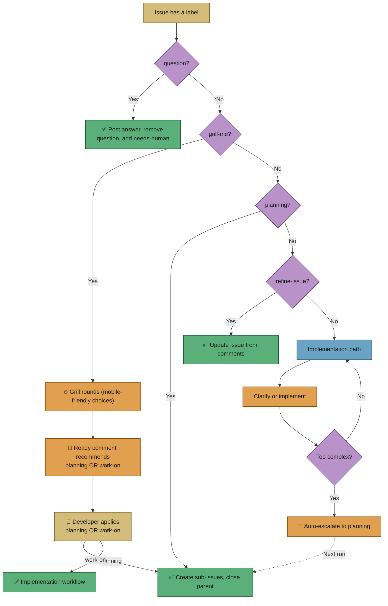
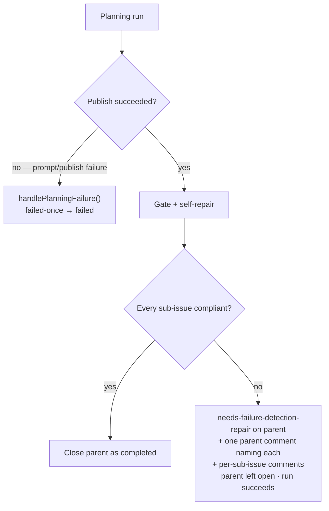
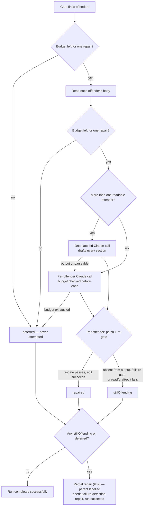
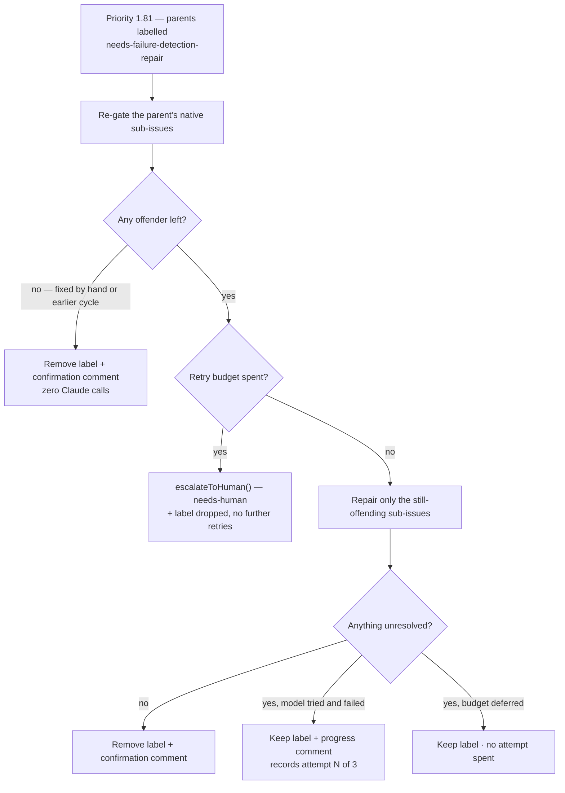
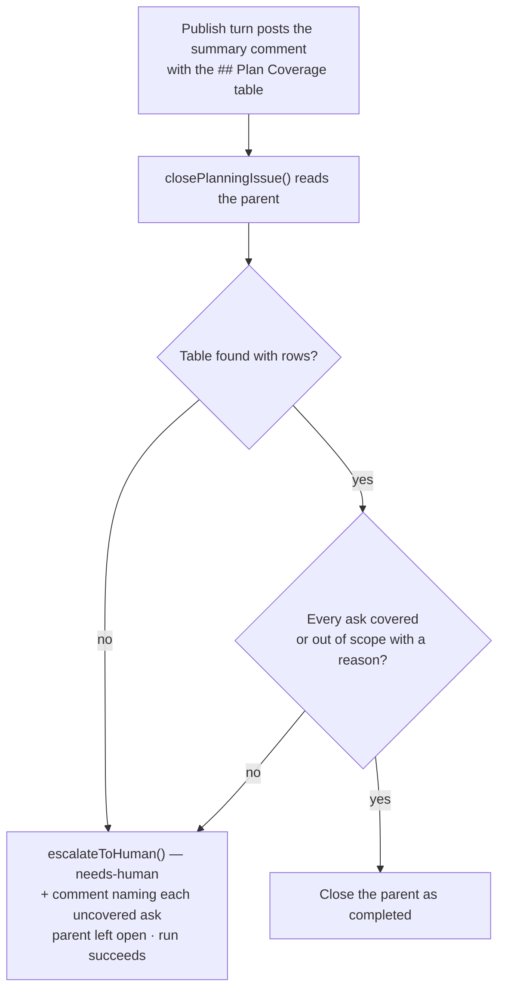
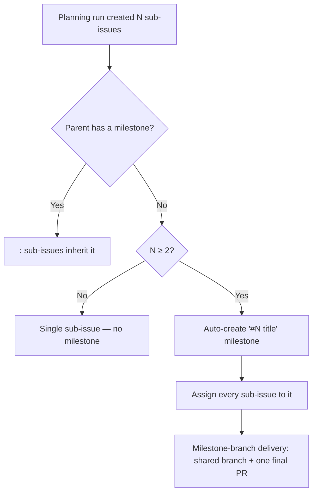
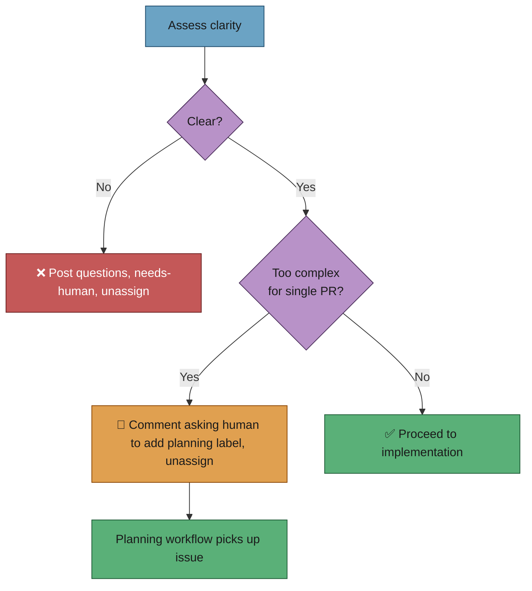
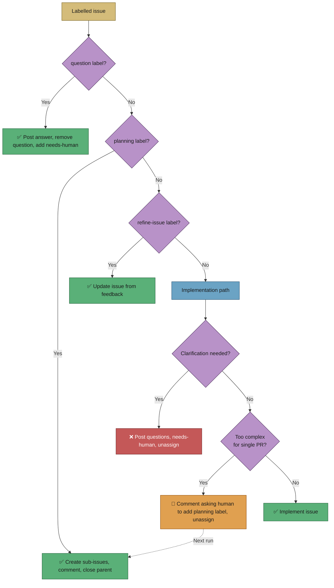

# 📝 Workflow: Planning, questions, refinement, clarification

This page is part of the **user manual** for the Vibe Coder. It describes the
non-coding workflows: planning (sub-issues), question answering, issue
refinement, and clarification before implementation. These workflows interact
only with the issue itself — no branches, commits, or PRs (Pull Requests) are
created. For internal details, see **Further reading** at the end.

---

## ⚡ TL;DR

**Four ways to use issues without writing code (yet).** Add a label and the
worker does something different: **question** → answer in a comment, remove
`question`, add `needs-human` (re-add `question` to ask a
follow-up); **planning** → draft-then-self-critique a breakdown into sub-issues
(carrying **no** reserved labels — you triage priority), post a model-usage
stats block, comment, close parent; **refine-issue** → update title/body from
your feedback; **clarification** (no label) → before implementing, worker may
ask questions and add `needs-human` if the issue is unclear. **Target
behaviour:** if the clarification phase detects an issue is too complex for a
single PR, it automatically adds the `planning` label and routes the issue
through planning (complexity-to-planning escalation). All of this happens on the
issue only — no branches or PRs until you go to implementation.



> **See also:** [grill-me.md](grill-me.md) for the full mobile-friendly grill
> workflow — when to reach for it instead of `planning`, what each round looks
> like, and how to drive the back-and-forth from a phone.

---

## 🎯 Purpose and scope

- **Purpose:** Define how the worker should behave when an issue has the
  `question`, `planning`, or `refine-issue` label, and how clarification
  (unclear requirements) is handled before implementation.
- **Scope:** Question (answer in comments, remove `question`, add `needs-human`
  so the user sees the turn signal); planning (create sub-issues, post summary,
  remove label, close parent); refinement (update issue title/body from
  feedback, remove label); clarification (assess clarity, post questions or
  proceed).

## 🎭 Actors and triggers

- **Question:** Issue has `question` label; allowed author or label added by
  allowed author.
- **Grill-me:** Issue has `grill-me` label; allowed author or label added by
  allowed author. Use when an issue is too vague or open-ended for `planning` —
  the worker runs an iterative, mobile-friendly back-and-forth (TL;DR + checkbox
  choices, with an `**⏳ Awaiting your reply.**` footer on every round) that
  refines a `## Current Understanding` section in the issue body each round. The
  processor adds `needs-human` immediately after each round comment to mark the
  developer's turn — the discovery filter skips any issue carrying
  `needs-human`, so the label list is the visible "your turn" indicator:
  `grill-me` alone = worker's turn, `grill-me + needs-human` = developer's turn
  (read the round comment, reply, then remove `needs-human`). When Claude judges
  there are no more meaningful questions, it posts a
  `## Grill-Me — Ready for Next Phase` comment recommending the developer apply
  `planning` (sub-issue breakdown) or `work-on` (single-PR implementation), and
  the worker removes **both** `grill-me` and `needs-human` automatically. The
  developer then applies the chosen label themselves; the worker never swaps
  labels for them. `maxGrillMeRounds` (default 5) is a safety cap — reaching it
  without convergence escalates to `needs-human` rather than finalising. See
  [grill-me.md](grill-me.md) for the full lifecycle, mobile workflow, failure
  modes, worked example, and the
  [Whose turn is it? (read the labels)](grill-me.md#-whose-turn-is-it-read-the-labels)
  table.
- **Planning:** Issue has `planning` label; allowed author or label added by
  allowed author.
- **Refinement:** Issue has `refine-issue` label; unprocessed comments from
  authorised commenters.
- **Clarification:** Part of implementation path; triggered when worker is about
  to implement and clarity assessment is enabled (under max rounds).

## 📏 Preconditions / invariants

- **Question:** Worker posts an answer comment, removes `question`, and adds
  `needs-human` to signal the user's turn. Re-add `question` to
  ask a follow-up.
- **Planning:** Worker must not create branches, commits, or PRs; only create
  sub-issues and comment. Sub-issues are created with **no reserved
  workflow/priority label** (you triage priority afterwards); the run uses
  two-stage self-critique and posts a model-usage stats block, applying the
  non-reserved `degraded-model` label to the parent and every sub-issue on a
  degraded run. Label removed after processing.
- **Refinement:** Only comments from authorised commenters trigger processing;
  worker updates issue and removes `refine-issue` after processing; add label
  again to iterate.
- **Clarification:** All interaction via GitHub; if unclear, post questions and
  add `needs-human`, unassign; user responds and removes label to retry.

### 🔓 Open-PR blocking does not apply

Planning, question, and refinement finders **do not check for open PRs**. The
worker can process these workflows even when the repo already has an open
implementation PR by the same user. This is intentional:

- These workflows only interact with the **issue itself** (comments, labels,
  sub-issues) — they never create branches, commits, or PRs.
- Open-PR blocking exists to prevent multiple concurrent **implementation** PRs
  targeting the same branch. Since planning, question, and refinement workflows
  produce no code changes, the constraint is irrelevant.
- In contrast, `find_oldest_issue()` (used for implementation) **does** enforce
  open-PR blocking — see [issue-processing.md](issue-processing.md) and
  [resilience-and-concurrency.md](resilience-and-concurrency.md).

This means a user can label an issue with `question` or `planning` and get a
response even while the worker has an unmerged PR in the same repository.

## ✅ Happy path

### ❓ Question

1. **Claim** — Claim the issue.
2. **Answer** — Run Claude with question prompt (timeout: 600 seconds by default
   —); post answer as issue comment.
3. **Clarification request** — If Claude determines the question is
   too broad or ambiguous, it outputs a structured clarification request
   (starting with `## Clarification Needed`) instead of a poor answer. The
   worker posts the clarification as a comment, removes the `question` label,
   adds `needs-human`, and unassigns. This does **not** count as a failure — no
   `failed-once` progression. You respond on the issue and re-add the `question`
   label to retry.
4. **Partial answer on timeout** — If Claude times out (exit code
   124 or 137) but has produced some output, that output is posted as a
   **partial answer** with a "Partial Answer (Timed Out)" disclaimer, rather
   than being discarded. The `question` label is removed (preventing retry
   loops), but `needs-human` and `failed-once` labels are **not** added. If the
   output is empty or only meta-commentary, normal failure handling continues.
5. **Cleanup** — Remove `question`; add `needs-human` so the label
   list reads as the user's turn. The user re-adds `question` to ask a
   follow-up.

### 📋 Planning

1. **Claim** — Claim the issue (assign self, verify).
2. **Run planning (two-stage self-critique)** — Build the planning prompt and
   run Claude. A planning run is **two sequential turns**: a **draft** turn that
   writes the plan as plain text with no side effects, followed by a **critique
   → revise → execute** turn that re-feeds the draft, adversarially attacks it,
   revises once, then creates the sub-issues via tool/API (no code changes). See
   [Two-stage self-critique planning](#-two-stage-self-critique-planning).
3. **Summarise** — Post comment on parent listing sub-issues and relationships,
   plus a model-usage stats block (see
   [Degraded-model observability](#-degraded-model-observability)).
4. **Cleanup** — Remove `planning` label; close parent issue.

#### 🏷️ Sub-issues carry **no** reserved labels

Sub-issues the worker files during planning are created **without** any reserved
workflow or priority label — none of `top-priority`, `work-on`, `low-priority`,
`planning`, `question`, `refine-issue`, `best-model`, `failed`, `needs-human`,
etc. The worker is not on the trusted-author allowlist, so any reserved label it
tried to apply would be silently stripped anyway; planning strips
them **at creation** instead, and the planning prompt is hardened to never
request them.

What this means for you: a fresh batch of sub-issues lands with only descriptive
labels (e.g. `documentation`, `enhancement`, `bug`). **You triage priority
afterwards** by adding the workflow label you want — `work-on` to queue one for
implementation, `top-priority` to push it to the front, `planning` to break it
down further, and so on. Nothing is queued until you say so.

> **Exception — `degraded-model` survives.** The `degraded-model` label is
> **not** a reserved label, so when planning applies it (see below) it sticks to
> the parent and to every sub-issue that run created. It is the one label a
> planning run leaves on its sub-issues, and it is your signal that the run may
> have used a fallback model worth reviewing.

#### 🚧 Pre-publish prevention

The presence gate and the self-repair below are **post-publication** backstops:
by the time they fire, the non-conforming sub-issues already exist on GitHub.
Prevention is cheaper, so the **publish turn** of the two-stage planning flow
(`prompts/planning_critique/` v4 onward) now instructs the model to verify each
sub-issue's `## Failure Detection` section **immediately before** running `gh
issue create`. The wording mirrors the gate's accepted shapes exactly — a
concrete test / CI gate / alert, or an explicit `N/A — <reason>`; a bare `[...]`
placeholder does not count — so prompt and gate never disagree. When a section
is missing, empty, or still the bracketed placeholder, the model **self-repairs
its own draft** (fills in the real criterion) rather than publishing a
non-conforming sub-issue; a sub-issue for which no real criterion can be stated
is treated as a **blocker** to publishing that sub-issue (re-scope, merge, or
drop it) rather than published-then-fixed. This is prompt-only prevention — the
deterministic presence gate and the model-driven repair below
remain the backstops.

The two **in-code fallback publish prompts** — `buildCritiqueFallbackPublishPrompt()`
(used when the critique prompt fails to build) and
`buildSingleInvocationPlanningPrompt()` (used when the draft stage produced no
usable plan) — carry the same requirement, so a run that degrades to a fallback
does not publish a whole plan of gate offenders. Both interpolate the single
exported `FAILURE_DETECTION_REQUIREMENT` constant in
`worker/deno/lib/planning_processor.ts` (alongside `RESERVED_LABEL_PROHIBITION`),
which states the section, the concrete test / CI gate / alert criterion, the
`N/A — <reason>` escape hatch, and that a bracketed placeholder does not count.
One constant means the fallbacks cannot drift from each other or from the gate.

#### 🛡️ Failure-Detection presence gate

After a planning run publishes its sub-issues, a **deterministic presence gate**
verifies that every published sub-issue body carries a filled `## Failure
Detection` section (the planner emits it from `prompts/planning/` v19 onward,
). This closes the "quality escape" of an unchecked prose rule: a
prompt instruction alone can be silently ignored, so the gate turns a missing
criterion into a **loud, labelled outcome** rather than a silent pass.

A sub-issue **passes** when its body contains a `## Failure Detection` heading
(or a bolded `**Failure detection:**` line) followed by non-whitespace content
that is **not** the bracketed template placeholder. An `N/A — <reason>` line
counts as satisfied (docs-only / prompt-only work). A sub-issue **fails** when
the heading is missing, the section is empty, or it is left as the bracketed
placeholder.

When any published sub-issue fails the gate the worker first attempts a
**model-driven self-repair** (see below). Whatever the repair cannot fix becomes
a **partial repair**, not a planning failure (see the next section). A run whose
sub-issues all carry the criterion (or that creates zero sub-issues) completes
normally — no behaviour change. The gate is
`worker/deno/lib/failure_detection_gate.ts`, wired into the single
`closePlanningIssue()` chokepoint; an unreadable sub-issue body is skipped
(best-effort) rather than mis-reported as a false failure.

#### 🩹 Partial repair leaves a resumable state (Issue #59)

A run that **published its sub-issues** and repaired only some of them is not a
failed planning run. The plan is published and usable, and the published
sub-issues stay published whatever the run reports — so marking the parent
`failed-once` only told the retry machinery to re-plan from the top, which is
the wrong recovery. On stSoftwareAU/GRQ-validation#835 that state was actively
misleading: 8 sub-issues published, 6 compliant, and the parent nonetheless
labelled `failed-once`.

That outcome is now distinct from a planning failure. When the run published
sub-issues but one or more still lack the criterion, the worker:

- applies **`needs-failure-detection-repair`** to the parent (never
  `failed-once` / `failed`);
- posts **one** parent comment naming every sub-issue still needing repair and
  the reason for each (shared wording with the failure comment — see
  `buildParentPartialRepairComment()`);
- posts the existing short, actionable comment on **each** offending sub-issue;
- leaves the parent **open** — reopening it when the planner closed it inline —
  so the repair stays discoverable; and
- returns a **success-shaped** result carrying
  `pendingFailureDetectionRepair`, so the run is not counted as a failed
  planning run.

`needs-failure-detection-repair` is **reserved** (`RESERVED_LABELS`), so the
planner can never apply it to a sub-issue as a descriptive label and manufacture
a phantom repair queue; the worker's own label guard allowlists it, because the
worker is the only thing that may raise it. The label and its apply helper live
in `worker/deno/lib/failure_detection_repair_label.ts`.

The **loud failure path is unchanged for genuine planning failures** — a prompt
failure, a timeout, or a publish failure still drives `handlePlanningFailure()`
with the `failed-once` → `failed` progression. This change narrows *when* the
gate fails a run, not the failure machinery itself.



#### 🔧 Model-driven self-repair

Before the gate hard-fails a run, the worker tries to **repair** each offending
sub-issue rather than dead-fail. This closes a **retry deadlock**: the gate runs
*after* sub-issues are published, and on a retry the recovery pre-check paths
(sub-issues found in existing comments, or via the GitHub API pre-check) skip
Claude entirely and go straight to `closePlanningIssue()`. Without repair the
gate fast-fails again in seconds with **no model invocation** — the run stats
then report "no served model observed" — and every subsequent retry repeats the
same fast-fail.

The repair (`worker/deno/lib/failure_detection_repair.ts`) runs once per
offender: it invokes Claude (planning-phase model/effort, so a degraded run
stays consistent with /) to draft a concrete `## Failure Detection`
section from the sub-issue's title/body — a real test / CI gate / alert, or an
explicit `N/A — <reason>` — patches it into the sub-issue body via `gh issue
edit`, and re-runs the **pure** gate to confirm the drafted section actually
passes. Each Claude call is recorded into the run's `invocations`, so stats no
longer say "no served model observed" on the repair path.



The repair is **best-effort and idempotent**: an offender whose body cannot be
read, whose Claude call fails/times out/empties, that the batched output omits,
whose draft still fails the gate, or whose `gh issue edit` throws stays in
`stillOffending` and is recorded on the parent as an outstanding repair
(Issue #59; before that it drove `handlePlanningFailure`). Only a positively
confirmed repair is reported as repaired. The re-gate is performed on the
constructed body *before* the patch, so a still-failing draft never overwrites
the sub-issue.

**Deadline-awareness (Issue #58)** stops the handler watchdog from killing the
repair mid-way. The repair runs *inside* the Planning handler, after sub-issues
are published; on one live run the watchdog killed the handler with 6 of 8
offenders repaired, and the two Claude calls still in flight were reported as
"timed out or was empty" — indistinguishable, in the logs and in the result,
from a genuine model failure. The dispatcher now hands each handler the exact
instant its watchdog will abandon it (`handlerHardTimeoutMs`, the same value the
watchdog arms, so the two cannot drift), the planning context carries it as
`handlerDeadlineEpochMs`, and `repairFailureDetectionSections()` checks the
remaining budget against a per-repair cost estimate (default 2 min, injectable)
**before every Claude invocation** — before the reads, before the batched call,
and before each per-offender call. When the budget cannot fit another repair the
pass stops cleanly and every un-attempted offender is returned in a separate
`deferred` list, logged with the budget named as the reason.

`deferred` ("we never tried — out of budget") is deliberately distinct from
`stillOffending` ("the model tried and could not produce a passing section"): a
deferred offender is no evidence that a repair is impossible, so a resumed run
may still fix it. Both sets are recorded as outstanding repairs on the parent
(Issue #59) — the criterion is missing either way, so a deferral is never a
silent pass. With no deadline supplied (tests, CLI paths) behaviour is unchanged
and `deferred` is empty.

#### 📊 The gate's hit rate is recorded in the run stats (Issue #63)

The gate and repair outcome used to be visible **only** by reading worker logs —
which is how its systemic scale was found (8/8 offenders on one run, 3/3 on
another, by grepping a single day's log) and why the omission went unnoticed long
enough for the self-repair to become a routine, load-bearing part of every
planning run rather than a rare fallback.

The planning run-stats comment now carries the counts, so the rate is measurable
without log archaeology:

```markdown
- **Failure-Detection gate:** published 8 · offenders 8 · repaired 6 · still offending 1 · deferred 1
- **Failure-Detection repair:** 1m 4s
```

`FailureDetectionGateStats` (`worker/deno/lib/planning_run_stats.ts`) is seeded
with **explicit zeros** at the gate call site in `closePlanningIssue()` and
populated on every path — clean, fully repaired, and partially repaired. A
metric emitted only on the unhappy path cannot distinguish "healthy" from "not
reporting", which is the failure mode this exists to fix, so a clean run records
`offenders 0` rather than omitting the fields. The counts are additive: the
established stats lines keep their exact shape and order, and the phases that
never gate sub-issues (grill-me and the other phase-parametric callers) supply
no gate stats and emit no gate lines.

#### ♻️ Resume pass finishes outstanding repairs (Issue #60)

A `needs-failure-detection-repair` parent is only a better state than
`failed-once` if a later cycle actually **finishes** the job. Priority **1.81**
(`Failure-Detection Repair Resume`, registered in `run_core.ts` as an
agent-backed handler) is that cycle. Each pass:

1. lists the open issues carrying the label in every configured repository
   (`worker/deno/lib/find_failure_detection_repair_issues.ts`);
2. enumerates the parent's **native** sub-issues — the original run's
   `subIssueUrls` are long gone by then — and re-runs the deterministic gate
   over them;
3. repairs only what is **still** offending, reusing
   `repairFailureDetectionSections()`; and
4. removes the label and posts a confirmation comment when nothing is left.

Re-gating first is what makes the pass **idempotent and self-healing**: a
sub-issue a human fixed by hand between cycles is no longer an offender, so an
already-clean parent costs **zero Claude calls** and simply loses its label.
Running outside the Planning handler also takes the repair off that handler's
watchdog budget entirely; the pass gets the dispatcher's own deadline, so
offenders it cannot fit are deferred exactly as they are inside planning.

**Retries are bounded.** A cycle that genuinely attempted a repair and still
failed records an attempt marker
(`<!-- failure-detection-resume-attempt: N -->`) in its parent comment — the
count lives in the comments so it survives a restart and reads the same for
every worker in the fleet. Once
`MAX_FAILURE_DETECTION_RESUME_ATTEMPTS` (3) attempts are spent, the parent goes
through the existing `escalateToHuman()` chokepoint (`needs-human` + an
explanation naming each sub-issue) and the resume label is dropped, so the pass
stops re-picking a parent that is now a human's to finish. Offenders the budget
merely **deferred** never spend an attempt: not having tried is no evidence that
a repair is impossible. A parent whose native sub-issues cannot be enumerated is
treated the same way as a failed repair — the label stays, the attempt is
recorded, and repeated failure escalates rather than looping.



#### 🗂️ Plan-coverage table and gate (Issue #520)

The critique turn has always been asked to hunt for "**missing work** — asks in
the issue with no sub-issue covering them", but the critique is deliberately
never published, so that judgement left **no artefact**: nobody could see which
ask maps to which sub-issue, and nothing failed when an ask was dropped. A
silently uncovered requirement looked exactly like a complete plan. Coverage now
takes the same shape as `## Failure Detection` did — a published artefact plus a
deterministic gate at the single `closePlanningIssue()` chokepoint.

**The artefact.** The publish turn (`prompts/planning_critique/` v6 onward)
posts a `## Plan Coverage` table inside its summary comment on the parent — one
row per ask in the issue's accepted scope (its `## Current Understanding` where
it has one, otherwise the asks in the body):

```markdown
## Plan Coverage

| Ask | Covered by | Notes |
| --- | --- | --- |
| Cache query results in-process | #101 | |
| Rewrite the query planner | #102 | Depends on #101 |
| Add a cache-eviction policy | Out of scope | The issue mentions it only as future work |
```

An ask deliberately left out of the plan is a **row too**, marked `Out of scope`
with the reason — never omitted, because an omitted ask is indistinguishable
from a forgotten one. Each sub-issue's `## Context` carries a matching
`Covers ask:` line (draft template `prompts/planning/` v22 onward), so a
reviewer can follow sub-issue → ask → parent.

**The gate.** `worker/deno/lib/plan_coverage_gate.ts` re-reads the parent at
`closePlanningIssue()` — the same chokepoint as the Failure-Detection gate,
never a second one — and locates the table by its **column signature** (an
ask column and a covering-sub-issue column), so a reworded heading cannot hide
it. A row **passes** when `Covered by` names at least one sub-issue (`#N` or a
GitHub issue URL), or when the ask is marked `Out of scope` **and** a reason is
given. A row **fails** when the cell is empty, reads `None` / `TBD`, or is left
as a bracketed placeholder — mirroring how the Failure-Detection gate rejects a
bracketed placeholder — and a bare `Out of scope` with no reason fails too. A
**missing** table, a table with **no rows**, and a parent that cannot be read
all fail: absence of the artefact is not evidence of coverage.

**The outcome — no second escalation path.** An uncovered ask needs a decision
no self-repair can make (create the missing sub-issue, or accept the ask as out
of scope), so the gate routes through the existing `escalateToHuman()`
chokepoint: `needs-human` plus one explanation comment naming every offending
ask and why. The parent is left **open** (reopened when the planner closed it
inline) and the run still completes with `uncoveredAsks` on its result — the
plan is published and usable, exactly as with a partial Failure-Detection
repair. The gate deliberately does **not** borrow
`needs-failure-detection-repair`: that label's resume pass re-gates Failure
Detection only, so it would find nothing to repair and clear the label, burying
the coverage defect. Both in-code fallback publish prompts interpolate the same
`COVERAGE_TABLE_REQUIREMENT` constant that lives beside the gate, so a degraded
run does not publish a plan the gate is bound to reject.



#### 🎯 Auto-milestone for sub-issues (Issue #2863)

When a planning run breaks an issue into **two or more** sub-issues **and the
parent issue has no milestone of its own**, the worker auto-creates a GitHub
milestone named `#<N> <title>` (from the parent issue) and assigns every
sub-issue it created to that milestone. This opts the whole batch into the
existing milestone-branch delivery workflow: each sub-issue PR
auto-merges into a shared `milestone/<name>` branch, and the default branch is
only updated via the single final milestone PR once all sub-issues close — the
"review once, run overnight" model.

The behaviour is **always on** (no opt-out flag or label) and **idempotent** —
re-running planning on the same parent never creates a duplicate milestone, and
a long parent title is truncated to fit. Two gates keep it out of the way:

- **Parent already has a milestone** → no new milestone; the existing
  inheritance behaviour assigns sub-issues to the parent's
  milestone instead.
- **Fewer than two sub-issues** → no milestone; a single sub-issue is delivered
  directly against the default branch.

If you do not want the milestone in a rare case, detach it manually after the
run. Milestone creation and assignment are **best-effort** — a GitHub failure is
logged and never blocks planning closure.

> **Robust sub-issue detection.** The auto-milestone only fires
> when the worker correctly counts the sub-issues a run created. Two refinements
> keep that count honest:
>
> - **The parent's own URL is excluded.** Claude's output (and its draft) almost
>   always links the parent planning issue. That self-reference is filtered out
>   before counting, so a run that merely echoes the parent no longer reports a
>   bogus "1 sub-issue" — which previously skipped every GitHub fallback and
>   suppressed the milestone.
> - **GitHub's native sub-issues API is consulted.** When the output carries no
>   genuine sub-issue URL, the worker queries
>   `repos/<owner>/<repo>/issues/<n>/sub_issues` first. This is authoritative:
>   it finds children regardless of body-text convention (`Part of #N`,
>   `Follow-up to #N`, or none) and has no search-index delay, with the
>   body-text list and search remaining as fallbacks.
>
> Without these, a real batch of native sub-issues could be missed, no milestone
> would be created, and the sub-issue PRs would target the default branch instead
> of the milestone feature branch.

#### 🔁 Two-stage self-critique planning

Planning does not take its first draft at face value. Each run is two sequential
Claude turns:

1. **Draft turn** — Claude writes the plan as plain text only. No sub-issues are
   created and nothing is published; this turn just produces the candidate
   breakdown.
2. **Critique → revise → execute turn** — The draft is sanitised (delimiter
   patterns neutralised so the draft cannot smuggle in instructions) and re-fed
   to Claude, which adversarially critiques its own plan, revises it **once** (a
   single iteration — KISS), and only then creates the sub-issues.

The critique itself is never published — you see the final sub-issues, not the
worker arguing with itself. If the draft turn fails or comes back empty,
planning **falls back to the original single-invocation flow**, so a run is
never worse than it was before self-critique existed.

#### 🎯 Auto-milestone for multi-issue plans

When a planning run breaks an issue into **2 or more** sub-issues and the parent
planning issue has **no milestone**, the worker automatically creates a GitHub
milestone named `#<N> <title>` (from the parent issue number and title) and
assigns every sub-issue it created to that milestone. This routes the batch
through the existing **milestone-branch delivery** model: each sub-issue PR
auto-merges into a shared `milestone/<name>` branch, and the default branch is
updated via a **single final PR** once all sub-issues close — the "review once /
run overnight" workflow (see [milestones.md](milestones.md)).

- **Always on, no opt-out.** Detach the milestone manually in the rare case you
  do not want it.
- **Single sub-issue → no milestone.** A plan that yields just one sub-issue is
  left as an ordinary default-branch issue.
- **Parent already has a milestone → unchanged.** The existing inheritance
  behaviour is preserved — sub-issues inherit the parent's
  milestone via `--milestone` and no new milestone is created.
- **Idempotent.** Re-running planning on the same issue matches the existing
  milestone of the same title (it is never duplicated) and re-assigns the same
  sub-issues harmlessly.
- **Non-fatal.** A milestone create/assign hiccup is logged and swallowed — it
  never aborts closing the planning issue.



Implementation: `worker/deno/lib/planning_milestone.ts`
(`ensurePlanningMilestone`), called from `closePlanningIssue` in
`worker/deno/lib/planning_processor.ts`.

#### 📈 Degraded-model observability

Every planning run posts a **model-usage stats block** as a comment on the
parent issue: the model that was requested, the model(s) that actually served
the responses, the effort level, token counts, turns, and duration. Posting the
stats is best-effort — a failure to post never fails the run.

A run is flagged **degraded** when a planning-phase response was served by a
model that does not match the resolved planning model (after prefix/alias-aware
matching), or when an explicit rate-limit fallback fired. On a degraded run the
worker applies the non-reserved **`degraded-model`** label to the **parent issue
and every sub-issue that run created**, so you can spot at a glance which work
came out of a possibly-degraded planning pass. The worker never removes
`degraded-model` — clear it yourself once you have reviewed the run.

### ✏️ Refinement

The refinement workflow lets you collaborate with Claude to improve an issue
**before** implementation starts. No branches, commits, or PRs are created — all
changes happen on the issue itself.

#### Step-by-step workflow

1. **Trigger** — Add the `refine-issue` label to the issue.
2. **Provide feedback** — Post comments on the issue describing what should be
   improved (e.g. "add acceptance criteria", "clarify the scope", "split the
   problem statement").
3. **Claim** — The worker picks up the issue and claims it atomically (prevents
   multiple workers from processing the same issue simultaneously).
4. **Gather feedback** — The worker collects unprocessed comments from
   authorised commenters. Comments already marked with an eyes (👀) reaction are
   skipped.
5. **Refine** — The worker sends the current issue title, body, and all
   unprocessed feedback to Claude. Claude analyses the feedback and produces an
   updated title and/or body.
6. **Apply updates** — The worker applies any suggested changes to the issue via
   the GitHub API.
7. **Post summary** — A `## Issue Refinement` summary comment is posted
   describing what changed and why.
8. **Cleanup** — The `refine-issue` label is **removed**, the `needs-human`
   label is **added** (signalling handoff for human review), and all processed
   feedback comments receive an eyes (👀) reaction. (retired the
   legacy `refined` completion label.)

#### Completion indicators

After a successful refinement, you will see all of the following on the issue:

| Indicator                        | What it means                                            |
| -------------------------------- | -------------------------------------------------------- |
| `refine-issue` label **removed** | The worker has finished processing                       |
| `needs-human` label **added**    | Handoff signal — a human should review the refined issue |
| `## Issue Refinement` comment    | Summary of what was changed and why                      |
| 👀 reaction on feedback comments | Each feedback comment has been read and processed        |

#### Re-triggering refinement

To refine the same issue again:

1. Post new feedback comments describing further improvements.
2. Re-add the `refine-issue` label.

The worker will process the new (unprocessed) feedback on the next scan cycle.
Previously processed comments (those with an eyes reaction) are not re-sent to
Claude. `needs-human` alone is not a discovery trigger, so the worker will not
pick the issue up until `refine-issue` is reapplied.

#### Protection mechanisms

| Mechanism                                  | What it prevents                                                                                         |
| ------------------------------------------ | -------------------------------------------------------------------------------------------------------- |
| **Atomic claiming**                        | Multiple workers processing the same issue simultaneously                                                |
| **Eyes (👀) reactions** on comments        | The same feedback being processed twice                                                                  |
| **`## Issue Refinement` header detection** | Infinite loops — if the worker has already responded and there is no new feedback, processing is skipped |
| **Authorised commenter check**             | Only comments from authorised users trigger processing                                                   |

#### When to use refinement

- When an issue description needs improvement before implementation begins
- When user feedback should be incorporated into the issue specification
- When an issue needs better acceptance criteria or clearer scope
- When the issue title does not accurately reflect the work to be done

#### Error handling

If the refinement fails (e.g. Claude times out, API errors), the worker:

1. Posts a `## Refinement Failed` comment explaining the error
2. Removes the `refine-issue` label to prevent the issue from being stuck in
   limbo
3. Does **not** add the `needs-human` label (so you can re-trigger after the
   issue is resolved)

#### Configuration

| Setting               | Default           | Description                                                                           |
| --------------------- | ----------------- | ------------------------------------------------------------------------------------- |
| `refineIssueLabel`    | `refine-issue`    | Label that triggers the refinement workflow                                           |
| `needsHumanLabel` | `needs-human` | Label added on successful completion to signal handoff for human review |
| `refinementTimeout`   | `300` (5 minutes) | Maximum time for Claude to process the refinement                                     |
| `refinementKillAfter` | `10` seconds      | Grace period before forceful termination after timeout                                |

### 💡 Clarification

The clarification phase runs **before** implementation and is important for
getting good results. It does three things:

1. **Is the issue clear?** If **unclear**, the worker posts questions as a
   comment, adds `needs-human`, unassigns, and exits (no implementation this
   run). You respond on the issue and remove the label; next run re-assesses.
2. **Is it small enough for a single PR / one run?** If the issue is too large,
   the worker posts an escalation comment asking a trusted human to add the
   `planning` label so the issue can be broken into smaller sub-issues. The
   worker does not add `planning` itself — see
   [Worker Label Policy](../../README.md#-supported-labels).
3. **Is it too large for a single PR?** If **clear but too complex** for one
   implementation, the worker posts an escalation comment and unassigns — a
   trusted human then adds the `planning` label and the issue is broken into
   sub-issues via the planning workflow (see
   [Automatic complexity-to-planning escalation](#-automatic-complexity-to-planning-escalation-target-behaviour)).
   No code is written until the issue is appropriately scoped.

**Flow:**

1. **Assess** — Run clarity assessment (e.g. Claude) on issue and comments.
2. **If CLEAR** — Proceed to complexity check (see below).
3. **If UNCLEAR** — Post clarifying questions as comment; add `needs-human`;
   unassign; exit (no implementation this run). User responds and removes label;
   next run re-assesses.

### 🔄 Automatic complexity-to-planning escalation (target behaviour)

> **📌 Note:** This section describes the **target workflow** — the intended
> behaviour for how the clarification phase should handle complex issues. The
> implementation may not yet fully match this documented behaviour; subsequent
> issues will bring the implementation in line.

When the clarification phase determines an issue is **clear but too complex**
for a single implementation attempt, it should automatically escalate the issue
to planning mode rather than proceeding with implementation. This avoids failed
implementation attempts on issues that are inherently multi-PR tasks.

#### How it works

1. **Complexity assessment** — After the clarity check passes, a complexity
   assessment evaluates whether the issue can be implemented in a single PR.
2. **If simple enough** — Proceed to implementation as normal.
3. **If too complex** — The worker automatically:
   - Posts a comment explaining why the issue was escalated (e.g. "This issue
     spans multiple directories and has several independent acceptance criteria
     — breaking into sub-issues for incremental implementation.") and asking a
     trusted human to add the `planning` label.
   - Unassigns itself from the issue.
   - Once a trusted human adds the `planning` label, the issue is picked up in a
     subsequent run via the normal **planning** workflow (create sub-issues,
     comment, close parent). The worker does **not** add the `planning` label
     itself — it is operational and reserved for trusted humans (see
     [Worker Label Policy](../../README.md#-supported-labels);,).

#### Criteria for automatic escalation

The following indicators suggest an issue is too complex for a single PR and
should be escalated to planning:

| Indicator                                           | Example                                                                                        |
| --------------------------------------------------- | ---------------------------------------------------------------------------------------------- |
| 🗂️ **Multiple directories in scope**                | Changes required in `worker/`, `tests/`, `docs/`, and `prompts/` with independent concerns     |
| 📄 **Many files referenced**                        | Issue explicitly names 5+ files that need non-trivial modifications                            |
| 🔍 **Audit/review spanning large scope**            | "Review all shell scripts for X" or "Update every workflow to include Y"                       |
| ✅ **Multiple independent acceptance criteria**     | Several acceptance criteria that could each be a standalone PR                                 |
| 🔀 **Cross-cutting concerns**                       | Changes that touch multiple subsystems with no shared implementation path                      |
| 📏 **Estimated scope exceeds single-PR guidelines** | The combined changes would produce an unreviewable PR (e.g. 500+ lines across unrelated files) |

These criteria are not exhaustive — the complexity assessment should use
judgement based on the overall scope and structure of the issue.

#### Flow: clarification with complexity escalation



## 📊 Diagram: workflow type routing



## ⏱️ Question timeout behaviour

| Setting            | Default                        | Behaviour                                                   |
| ------------------ | ------------------------------ | ----------------------------------------------------------- |
| `QUESTION_TIMEOUT` | `600` (10 minutes,) | Hard ceiling — Claude process is killed after this duration |

When a question times out:

1. **Partial output exists** → posted as a partial answer with a
   disclaimer. The `question` label is removed to prevent retry loops.
2. **No useful output** → normal failure handling (comment, `failed-once`
   label).

This timeout was increased from 300s (5 minutes) to 600s (10 minutes) to allow
sufficient time for complex questions requiring Claude to analyse external
repositories or read large codebases.

## 🔀 Decision points and exceptions

- **Question failure:** Same failure semantics as other work (e.g. track
  failure, optional label); the workflow avoids leaving an issue stuck with
  `question` and no answer indefinitely.
- **Question clarification:** If Claude determines a question is
  too broad or ambiguous, it outputs a clarification request instead of a poor
  answer. This is not a failure — the user responds and re-adds `question` to
  retry.
- **Question timeout with partial output:** Partial answers are
  posted rather than discarded. This gives the user useful content even when
  Claude could not complete its analysis within the timeout.
- **Planning:** If Claude does not create sub-issues (e.g. output not detected),
  worker may still post a comment and remove label; the workflow is to validate
  sub-issues (e.g. via API) when possible.
- **Refinement:** No new feedback comments — if worker already responded once,
  skip to avoid loop; tell user to add feedback or remove label.
- **Clarification:** Max rounds (e.g. 3) after which worker proceeds with
  implementation; round 1 prefer proceed, round 2+ strongly prefer proceed or
  make assumptions.

## 📚 Further reading

- **Internals:** [Worker Internals](../INTERNALS.md) — run loop, issue
  selection, PR monitoring, milestone/dependency handling.
- **Implementation details:** [worker/deno/lib/run_core.ts](../../worker/deno/lib/run_core.ts),
  [worker/deno/lib/issue_worker.ts](../../worker/deno/lib/issue_worker.ts),
  [worker/deno/lib/claim_issue.ts](../../worker/deno/lib/claim_issue.ts),
  [worker/deno/lib/partial_answer.ts](../../worker/deno/lib/partial_answer.ts),
  [worker/deno/lib/question_clarification.ts](../../worker/deno/lib/question_clarification.ts),
  [worker/deno/lib/planning_processor.ts](../../worker/deno/lib/planning_processor.ts)
  (two-stage flow),
  [worker/deno/lib/planning_run_stats.ts](../../worker/deno/lib/planning_run_stats.ts)
  (stats + degraded verdict),
  [worker/deno/lib/planning_degraded_label.ts](../../worker/deno/lib/planning_degraded_label.ts)
  (label application), [prompts/planning/](../../prompts/planning/),
  [prompts/question/](../../prompts/question/).
- **Model and caching:** [MODEL-AND-CACHING.md](../MODEL-AND-CACHING.md) —
  planning-run stats and degraded-model detection.
- **User docs:** [README.md](../../README.md), [USAGE.md](../USAGE.md),
  [issue-processing.md](issue-processing.md).
