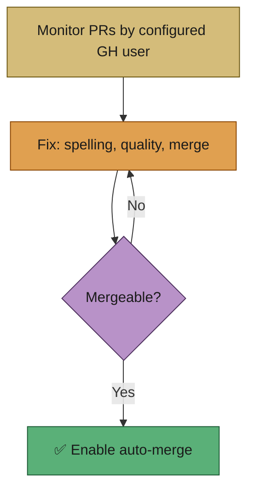
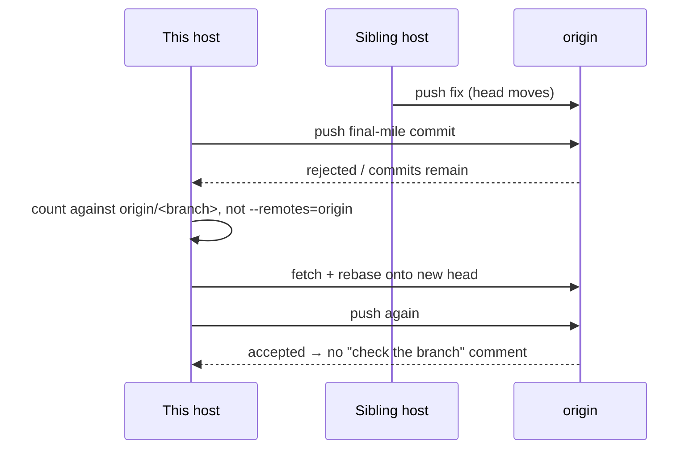
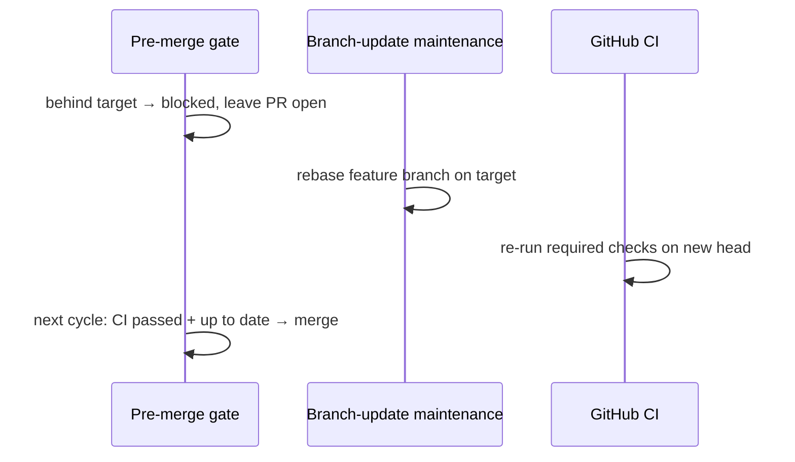
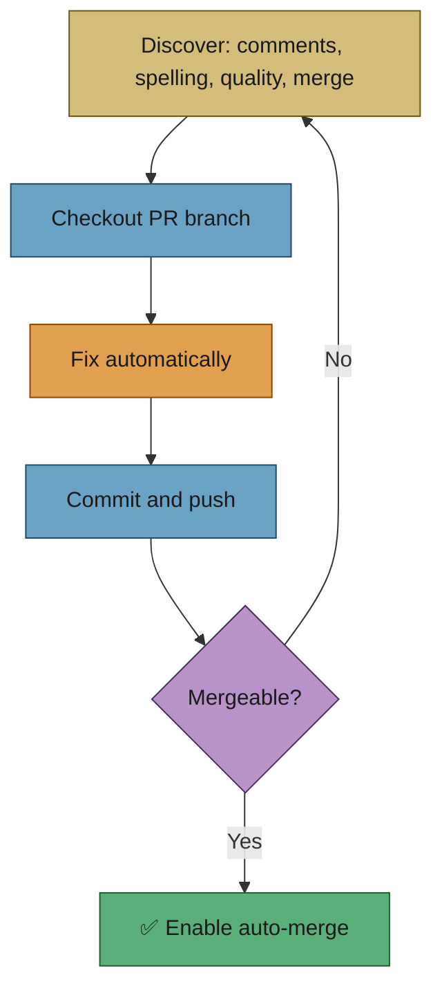
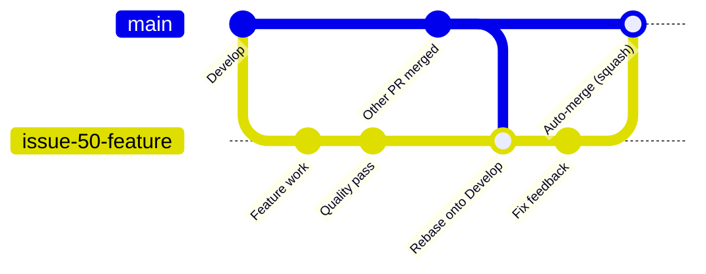
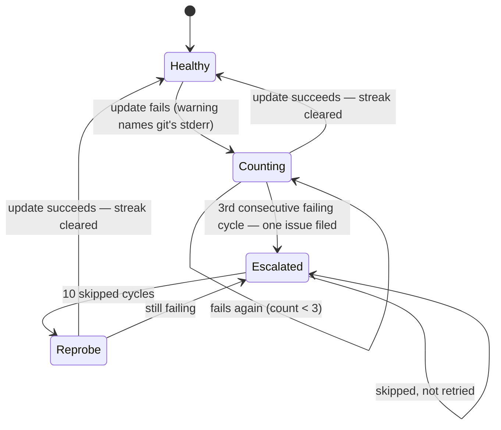

# 💬 Workflow: PR (Pull Request) feedback and upkeep

This page is part of the **user manual** for the Vibe Coder. It describes how
the appliance **monitors PRs authored by the configured GitHub user** (e.g.
stsvcbot), fixes spelling and quality (shellcheck, Deno quality checks) and
merge issues, and enables auto-merge when mergeable. Before any merge, a
**dual-layer pre-merge gate** insists CI is green and the branch is up to date,
and the default branch stays **read-only**. For internal details, see **Further
reading** at the end.

---

## ⚡ TL;DR

**Only PRs authored by the configured GitHub user are watched; problems on those
PRs are fixed without being asked.** There is **one Vibe Coder per hostname**,
and the **same GitHub user** (e.g. stsvcbot) is often shared by many Vibe
Coders. The worker monitors **all open PRs by that user** — it does not act on
other users’ PRs. It fixes **spelling** and **quality** (shellcheck, Deno
quality checks) failures, keeps branches **up to date** with the base
(rebase/merge), and resolves **merge conflicts** when it can. **Auto-merge** is
turned on only when the PR is actually mergeable, and every merge first passes a
**pre-merge gate** that re-checks CI and branch freshness. User feedback
(comments, "Request changes") is also handled: address it, push, mark processed.
If a piece of feedback is genuinely **out of scope** for one run, the worker
takes the **escape hatch** — it files a follow-up issue, replies once naming it,
and exits cleanly rather than looping.

---

## 🎯 Purpose and scope

- **Purpose:** Define how the worker monitors **only PRs authored by the
  configured GitHub user**, **automatically** fixes spelling failures, quality
  failures (e.g. shellcheck, Deno quality checks), and merge issues (without
  waiting for user feedback), keeps those PRs mergeable, and enables auto-merge
  only after merge issues are resolved.
- **Scope:** PR comment feedback (with thumbs-up or authorised commenter),
  CHANGES_REQUESTED reviews; **proactive** spelling and quality (shellcheck,
  Deno quality checks) fix; PR branch updates and mergeability; auto-merge (only
  when mergeable).
- **Not in scope:** Issue selection and milestone-aware open-PR blocking for
  **new issues** — that is a separate concern handled during issue discovery
  (see [issue-processing.md](issue-processing.md) and
  [milestones.md](milestones.md)). Both use the same author-scoped query
  (`--author "$github_user"`) but serve different purposes: PR monitoring fixes
  existing PRs; issue selection decides which new issue to work on next.

## 🔍 Which PRs are monitored?

The worker monitors **all open PRs whose author is the configured GitHub user**
(e.g. stsvcbot). It does not act on other users’ PRs.

**Shared GitHub user, one Vibe Coder per host:** The same GitHub user is often
used by **many** Vibe Coders — **one Vibe Coder per hostname**. So PRs are
identified by **author** only; the API does not reveal which host created which
PR. Every worker using that account sees the same set of open PRs and may pick
work from it (e.g. PR feedback, spelling fix); coordination is by the usual loop
(one item per iteration, other workers may claim issues first). Identification
is by **author** (e.g. `gh pr list --author "$github_user"`).

**Labelling a PR:** GitHub allows labels on PRs (PRs are issues under the hood).
You could add a label (e.g. `vibe-coder` or per-host) to mark which worker
created a PR; the **current workflow uses author only** and does not require a
label. **Tracing back to the issue:** The PR body typically contains "Closes #N"
or "Addresses #N"; that link is used for context (e.g. PR summary, milestone)
but the worker does not need to trace back to the issue to know whether to
monitor the PR — author is sufficient.

## 🎭 Actors and triggers

- **Triggers (in priority order):** (1) PR feedback — an **open PR authored by
  the configured GitHub user** has unprocessed feedback (comment with thumbs-up
  or from authorised commenter, or CHANGES_REQUESTED review **from an
  authorised commenter**). (1.5)
  Spelling/quality — such a PR has a failed check: **spelling** (e.g. spell,
  cspell, typo, codespell) or **quality** (e.g. shellcheck, Deno quality checks)
  — fixed automatically. (1.6) Branch updates — the PR branch is behind base or
  has merge conflicts. (1.65) Auto-merge — the PR exists but auto-merge is not
  enabled (and the PR is mergeable).
- **Actors:** The worker (one per hostname, often sharing one GitHub user);
  GitHub API; Claude (for feedback and spelling/code fixes).

## 📏 Preconditions / invariants

- Configuration is valid; `authorized_commenters` and PR reviewer settings are
  set as required.
- The worker only acts on **PRs authored by the configured GitHub user**. It
  does not monitor or modify other users’ PRs. (The same user may be shared by
  many Vibe Coders, one per hostname.)
- **All such PRs are monitored** — On every open PR by that user, spelling
  mistakes, quality issues (shellcheck, Deno quality checks), and merge issues
  are **automatically fixed**; the worker does not wait for a user to request
  these fixes.
- **Auto-merge only when mergeable** — Every PR should be marked for auto-merge,
  but auto-merge is only enabled **after** merge issues have been fixed. The
  worker must not enable auto-merge on a PR that has merge conflicts or is
  otherwise not mergeable.
- Feedback is processed once: after handling, comments are marked (e.g. eyes
  reaction) and reviews are dismissed so they are not picked up again.

## ✅ Happy path

The sub-tasks below are listed in **priority order**, matching the worker's main
loop in the Deno `run-core` command. Each priority level is checked before the next; the first
match wins and the loop restarts.

### 🔴 Priority 1 — PR feedback

1. **Discover** — Find an open PR by this user that has unprocessed feedback
   (comment with thumbs-up or from authorised commenter, or CHANGES_REQUESTED
   review). A review body goes straight into the feedback prompt, so — like a
   PR comment — it is only actioned when its author is an **authorised
   commenter**; an unauthorised reviewer's `CHANGES_REQUESTED` body is skipped
   with a `UNAUTHORISED_REVIEW_SKIPPED` security log (Issue #185).
   A comment a **sibling fleet host has already pushed against** is not
   claimed: if a fleet author pushed to the PR after the comment was written,
   and that push is less than 15 minutes old, the comment is left for the next
   scan to re-evaluate (Issue #211). The window is a de-duplication guard, not
   a veto — an older fleet push never suppresses feedback permanently.
2. **Checkout** — Checkout the PR branch in the target repo.
3. **Process** — Run Claude (or equivalent) to address feedback; apply code or
   reply; commit and push.
4. **Mark processed** — Add eyes reaction to comment and/or dismiss review so it
   is not picked again.

#### The final mile — did the push actually land?

Every Claude-driven phase ends with a commit-and-push, and the worker only
claims success when git says the branch is on origin. Two rules make that
honest (Issue #211):

- **The count is measured against origin's copy of the branch.** Fleet workdirs
  are single-branch clones, so `refs/remotes/origin/<feature>` does not exist —
  counting with `--remotes=origin` measured commits ahead of the *default*
  branch and reported a fully pushed branch as unpushed. When the tracking ref
  is absent the branch is fetched and the count is taken against that head. A
  count that cannot be established is an error, never a silent zero.
- **A head that moved mid-run is rebased onto, not handed to a human.** When
  commits genuinely remain, the worker fetches, rebases onto the current remote
  head (which a sibling host may have moved) and pushes again. Only when that
  recovery genuinely fails does it reply on the PR — and the reply names the
  step that failed (`pull-rebase`, `force-with-lease`, `retry-push`) plus git's
  own stderr.

**Out-of-scope feedback → escape hatch.** Sometimes a review
comment asks for something genuinely too large for one run — a multi-day
refactor, a change that depends on a product decision only a human can make, or
work that bundles several independent pieces. Rather than looping until the
timeout, the worker takes the **escape hatch**: it opens a follow-up issue
capturing the analysis (the problem, what was investigated, what is blocking,
and what a solution would look like), posts **one** reply on the PR naming that
follow-up issue (using the words "out of scope" / "follow-up issue") and
mentioning `needs-human` if a person should triage, then exits cleanly without
retrying the original change. The relief valve only fires after a serious
attempt — it is not a shortcut to skip difficult work. The hand-off is only
recorded as a resolution when the follow-up issue it names **exists and was
filed by the worker, a fleet sibling, or an allowlisted author** — naming a
pre-existing issue is not evidence of a hand-off (Issue #185). See
[DESIGN-PRINCIPLES.md → Escape hatch for out-of-scope work](../../DESIGN-PRINCIPLES.md).

### 🟠 Priority 1.5 — Spelling and quality fixes (automatic)

The worker **proactively** fixes spelling and quality failures on all its PRs —
no user request needed. This applies to:

- **Spelling** — Failed check runs whose name indicates spelling (e.g. spell,
  cspell, typo, codespell). Obtain annotations, apply fixes (code or
  dictionary), commit and push, comment on PR.
- **Quality** — Failed checks such as **shellcheck**, **deno lint**, or **deno
  test** (and other configured quality gates). The worker runs the same quality
  checks (e.g. `./quality.sh`) and fixes reported issues by committing and
  pushing, then comments on the PR.

Flow: discover failed check → checkout PR branch → fix issues → commit and push
→ comment. These fixes are automatic so that PRs reach a mergeable, passing
state without waiting for user feedback.

### 🟡 Priority 1.6 — Keeping PRs mergeable

PRs must be kept in a **mergeable** state so they can be merged when reviews and
checks pass. The worker does the following:

1. **Detect out-of-date branches** — For each open PR by this user, check
   whether the PR branch is behind its **actual base branch** (fetched via
   `baseRefName` from the GitHub API). The base is the branch the PR targets —
   this may be the repo default branch or a milestone branch (e.g.
   `milestone/oidc`). If `baseRefName` is unavailable, the repo default branch
   is used as a fallback.
2. **Update the branch** — If the branch is behind the base: fetch the latest
   base branch, rebase the feature branch onto it, and push. The comparison and
   rebase always use the PR's actual base branch, so PRs targeting milestone
   branches are updated against that milestone branch, not the repo default
  . This keeps the PR up to date and avoids merge conflicts at
   merge time.
3. **Resolve merge conflicts** — Conflicts are judged against **origin's head
   for the branch**, which is what GitHub merges: the branch is fast-forwarded
   to that head before it is evaluated, so a stale local copy left in the
   workdir can no longer produce a conflict that does not exist on the PR
   (Issue #211). A local branch holding genuinely unpushed commits is reported
   as exactly that and left untouched — never relabelled a base-branch
   conflict. If rebase or merge hits real conflicts, the worker
   attempts automatic resolution (e.g. resolve strategy). If resolution
   succeeds, push the updated branch. If it fails, the branch is left as-is and
   the failure is logged; the PR remains in a non-mergeable state until the user
   or a later run resolves it.
4. **After PR creation or recovery** — When a PR is created or an existing PR is
   recovered, the worker runs a mergeability check and, if the branch is behind
   base, rebases and resolves conflicts **before** enabling auto-merge.
   **Auto-merge is only enabled once the PR is mergeable.**

So: **PRs are always kept mergeable when possible**. If a PR is out of date, the
branch is automatically updated and merge issues resolved; if automatic
resolution fails, the run continues and the next cycle may retry or the user can
intervene.

### 🟢 Priority 1.65 — Auto-merge

- **All PRs by the configured GitHub user should be marked for auto-merge**
  (squash), so they merge automatically when reviews and checks pass.
- **Auto-merge can only be enabled when merge issues have been fixed** — i.e.
  when the PR is mergeable (no conflicts, branch up to date with base). The
  worker must resolve merge issues first, then enable auto-merge.
- **Catch-up** — For each open PR by this user, if auto-merge is not yet enabled
  and the repo supports it and the PR **is mergeable**: enable auto-merge. This
  catches PRs where auto-merge was not set due to transient failures during
  creation or where merge issues have since been fixed.

## 🛡️ The dual-layer pre-merge gate

Enabling auto-merge is **not** the last word. Every required CI status check
must pass **before** a feature branch merges into the repo's default branch —
never after. A post-merge failure is too late: by then the deploy/publish
workflows have already fired. Enforcement is **dual-layer**, and the default
branch is held strictly **read-only**.

- **The wall (GitHub branch protection).** Required status checks plus a strict
  "branch up to date" rule, configured once per monitored repo at setup time.
  This holds the native auto-merge path (`gh pr merge --auto`) until CI is green
  and the branch is current. Required-check selection is visibility- and
  language-aware, so an unsatisfiable check (e.g. a GHAS-only check on a private
  repo) is never marked required — otherwise it would block **every** merge.
- **The backstop (worker pre-merge gate).** For the direct-merge fallback used
  on unprotected branches, `enforcePreMergeRequirements()` re-fetches CI status
  and branch freshness **at merge time** and refuses to merge unless CI is
  `passed` and the branch is **not behind** its target. Both signals are
  re-fetched fresh, never reused from PR-creation time.
- **Read-only default branch.** The worker never pushes commits directly to the
  default branch — no formatting, version, or dependency bumps. Every change
  rides a feature-branch PR through the same gate.

### Defer-and-retry when the branch is behind target

When the gate blocks because the PR branch is **behind its target**, the worker
does not force the merge and does not give up — it **defers and retries**:

1. The PR is **left open** and the deferral is logged.
2. The branch-update maintenance (Priority 1.6 above) rebases the feature branch
   onto the latest target.
3. CI re-runs on the new head.
4. The next cycle re-evaluates the gate and merges once CI is green and the
   branch is up to date.

This is an automatic **auto-update → re-check → merge-if-green** loop with no
bespoke retry machinery — the same maintenance that keeps PRs mergeable also
clears the deferral.

For the full operator detail — the visibility-aware required-check selection,
the defer-and-retry sequence, the trigger-classification table, and the
failure/recovery modes — see [`docs/MERGE.md`](../MERGE.md) and
[DESIGN-PRINCIPLES.md → Dual-layer pre-merge enforcement](../../DESIGN-PRINCIPLES.md).

## 📊 Diagram: PR monitoring and fixes

## 📊 Diagram: branch update flow (gitGraph)

The following `gitGraph` diagram shows how the worker keeps PR branches up to
date — when the base branch receives new commits, the feature branch is rebased
to stay current before auto-merge:

_The `main` line represents `Develop`. When new commits land on `Develop` (from
other merged PRs), the worker rebases the feature branch to keep it current.
After feedback fixes and quality checks, the PR is auto-merged._

## 🔁 A branch that can never be updated (Issue #335)

A branch update that fails is retried on the next cycle — correct for a
transient failure, useless for a permanent one. One branch in
`stSoftwareAU/NEAT-AI-core` logged the same
`Failed to checkout branch 'issue-3832-detect-cycles-linear'` warning **65
times** across days: nothing counted the repeats, nothing escalated, and the
line never said *why* git refused.

The pass now keeps a per-`(repo, branch)` memory in
[`pr_branch_update_failure_streak.ts`](../../worker/deno/lib/pr_branch_update_failure_streak.ts)
— the same shape as the bump-script (Issue #207) and idle-inversion
(Issue #321) streaks:

| Cycle outcome | What happens |
| --- | --- |
| Update succeeds | The streak is deleted — the next failure counts from one |
| Update fails, count below 3 | Counted; the warning carries git's own stderr |
| Third consecutive failing cycle | **One** issue is filed against the repo naming the PR, the branch, the count and the git error |
| Any cycle after escalation | The branch is skipped, not retried — re-probed once every 10 cycles so a fixed branch heals itself |

The count is per `(repo, branch)`, so one stuck branch never suppresses updates
for the rest, and it counts **cycles**, not attempts — a pass that runs twice in
one cycle counts once. The escalation issue is filed with no label (the worker
cannot self-apply `work-on`), deduped on a body marker so two hosts converge on
one issue, and never filed twice for the same streak.

## 🔀 Decision points and exceptions

- **No feedback / no spelling / no stale branches:** Skip; no side effects.
- **Push rejected (e.g. conflict):** Pull/rebase and retry; if rebase fails,
  create fresh branch from base, cherry-pick or re-apply, push, and update PR
  head if needed (see git_operations / pr_manager).
- **Auto-merge not available (repo setting):** Comment on PR that manual merge
  is required; do not fail the run.
- **Spelling fix failure:** Treated like other failures; may trigger failure
  tracking and eventual exit for restart.
- **PR branch behind target at merge time:** The pre-merge gate **defers** —
  the PR is left open, branch-update maintenance rebases, CI re-runs, and the
  next cycle re-evaluates (see the dual-layer pre-merge gate above). The merge is
  never forced against a stale branch.
- **Out-of-scope PR feedback:** The worker takes the **escape hatch** — files a
  follow-up issue, replies once naming it (mentioning `needs-human` if a person
  should triage), and exits cleanly rather than looping.

## 📚 Further reading

- **Merge enforcement:** [Merge Enforcement — Operator Manual](../MERGE.md) —
  the dual-layer pre-merge gate, visibility-aware required checks,
  defer-and-retry, read-only default branch, and workflow-trigger normalisation.
- **Design overview:** [DESIGN-PRINCIPLES.md](../../DESIGN-PRINCIPLES.md) — dual-layer pre-merge
  enforcement and the out-of-scope escape hatch.
- **Internals:** [Worker Internals](../INTERNALS.md) — run loop, issue
  selection, PR monitoring, milestone/dependency handling.
- **Implementation details:** [worker/deno/lib/run_core.ts](../../worker/deno/lib/run_core.ts),
  [worker/deno/lib/issue_worker.ts](../../worker/deno/lib/issue_worker.ts),
  [worker/deno/lib/pr_ci_checks.ts](../../worker/deno/lib/pr_ci_checks.ts),
  [worker/deno/lib/pr_comments.ts](../../worker/deno/lib/pr_comments.ts),
  [worker/deno/lib/git_branch.ts](../../worker/deno/lib/git_branch.ts),
  [quality.sh](../../quality.sh).
- **User docs:** [README.md](../../README.md), [USAGE.md](../USAGE.md),
  [CONFIGURATION.md](../CONFIGURATION.md),
  [resilience-and-concurrency.md](resilience-and-concurrency.md).
