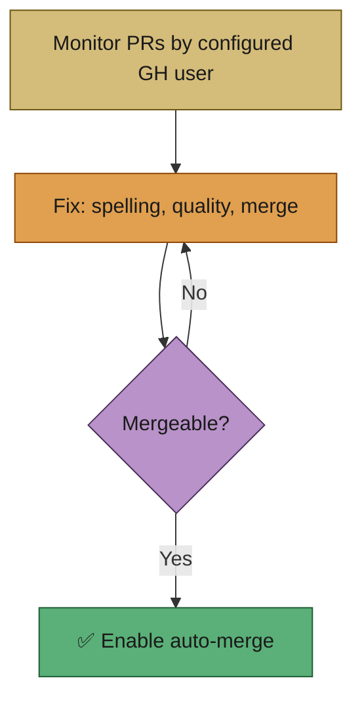
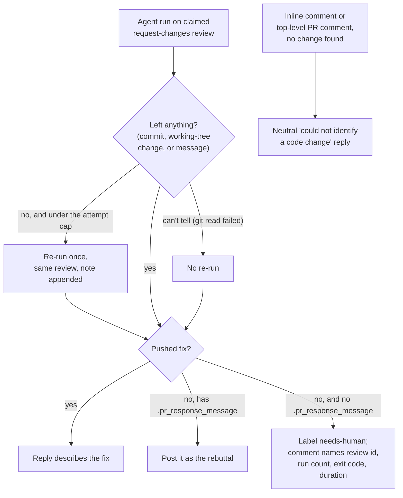
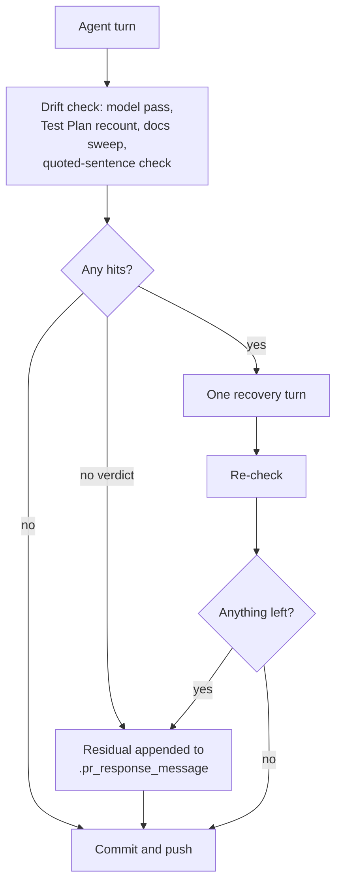
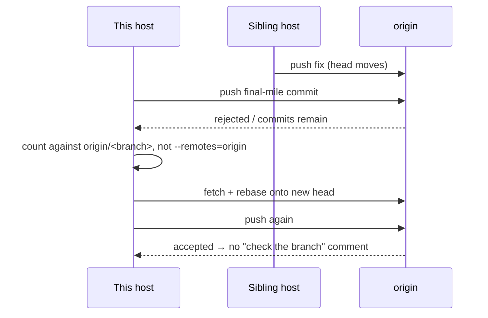
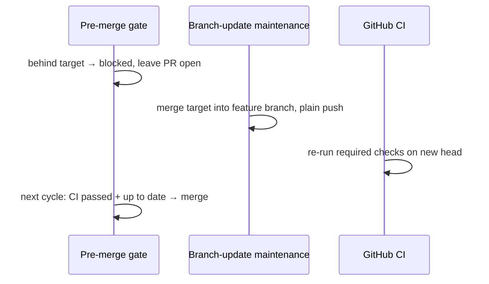
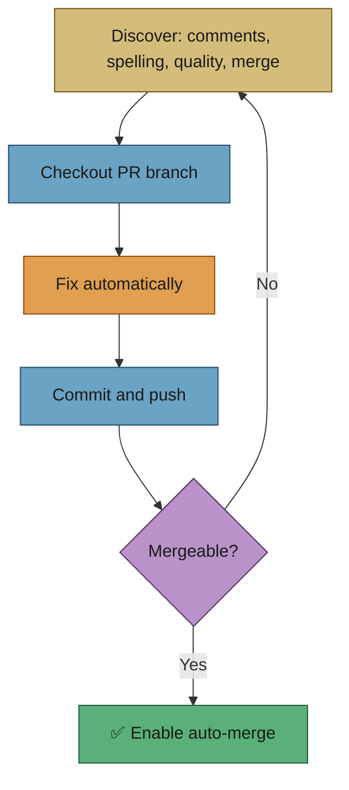
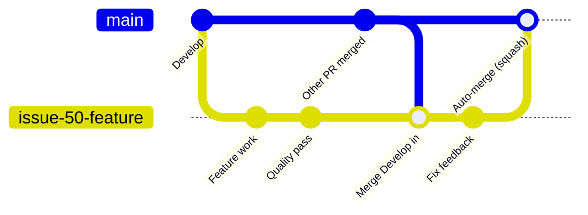
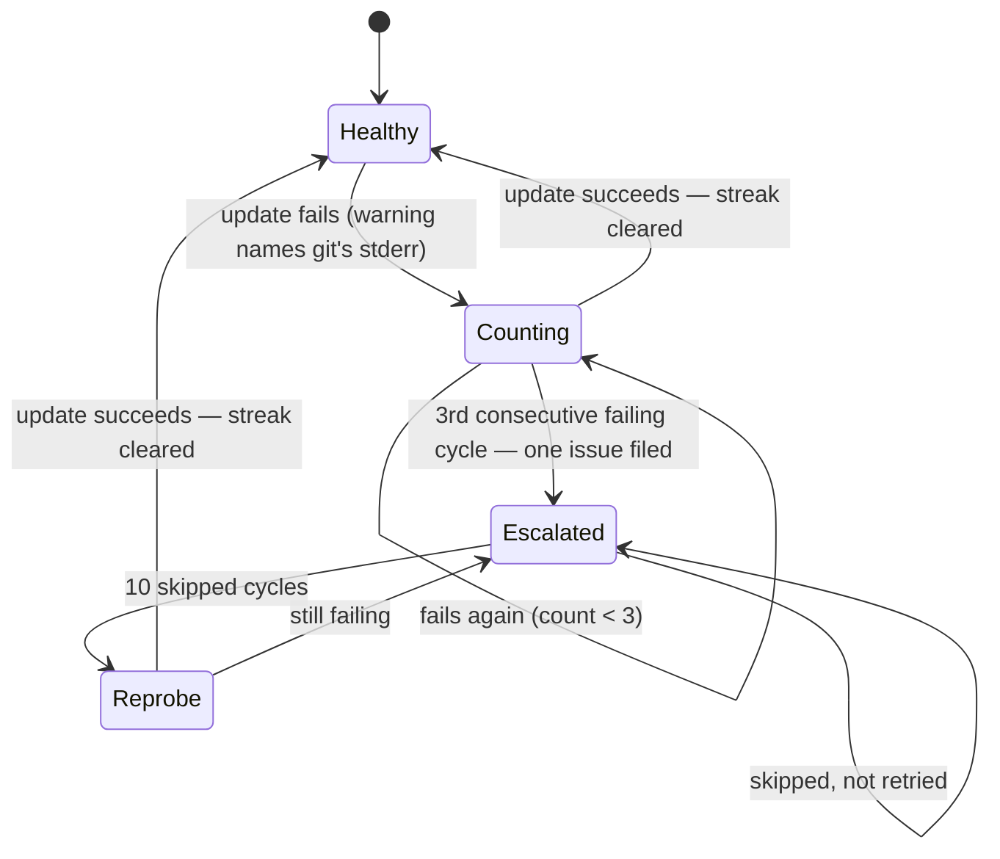
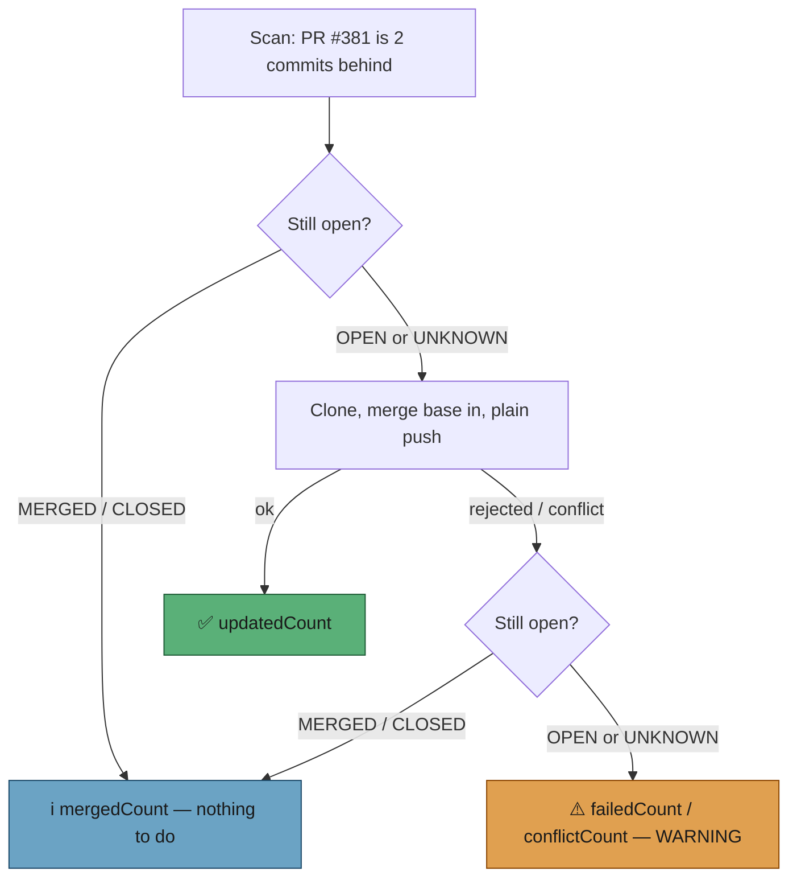

# 💬 Workflow: PR (Pull Request) feedback and upkeep

This page is part of the **user manual** for the Vibe Coder. It describes how
the appliance **monitors PRs authored by the configured GitHub user** (e.g.
stsvcbot), fixes spelling and quality (shellcheck, Deno quality checks) and
merge issues, and enables auto-merge when mergeable. Before any merge, a
**dual-layer pre-merge gate** insists CI is green and the branch is up to date,
and the default branch stays **read-only**. For internal details, see **Further
reading** at the end.

---

## ⚡ TL;DR

**Only PRs authored by the configured GitHub user are watched; problems on those
PRs are fixed without being asked.** There is **one Vibe Coder per hostname**,
and the **same GitHub user** (e.g. stsvcbot) is often shared by many Vibe
Coders. The worker monitors **all open PRs by that user** — it does not act on
other users’ PRs. It fixes **spelling** and **quality** (shellcheck, Deno
quality checks) failures, keeps branches **up to date** with the base
(rebase/merge), and resolves **merge conflicts** when it can. **Auto-merge** is
turned on only when the PR is actually mergeable, and every merge first passes a
**pre-merge gate** that re-checks CI and branch freshness. User feedback
(comments, "Request changes") is also handled: address it, push, mark processed.
If a piece of feedback is genuinely **out of scope** for one run, the worker
takes the **escape hatch** — it files a follow-up issue, replies once naming it,
and exits cleanly rather than looping.


```mermaid
flowchart TD
  Monitor["Monitor PRs by configured GH user"] --> Fix["Fix: spelling, quality, merge"]
  Fix --> Mergeable{"Mergeable?"}
  Mergeable -->|Yes| AutoMerge["✅ Enable auto-merge"]
  Mergeable -->|No| Fix
  style Monitor fill:#d4bc7a,stroke:#6b5510,color:#1a1a1a
  style Fix fill:#e0a050,stroke:#8b4500,color:#1a1a1a
  style Mergeable fill:#b892c8,stroke:#4a2d5a,color:#1a1a1a
  style AutoMerge fill:#5ab078,stroke:#1d5a35,color:#1a1a1a
```

---

## 🎯 Purpose and scope

- **Purpose:** Define how the worker monitors **only PRs authored by the
  configured GitHub user**, **automatically** fixes spelling failures, quality
  failures (e.g. shellcheck, Deno quality checks), and merge issues (without
  waiting for user feedback), keeps those PRs mergeable, and enables auto-merge
  only after merge issues are resolved.
- **Scope:** PR comment feedback (with thumbs-up or authorised commenter),
  CHANGES_REQUESTED reviews; **proactive** spelling and quality (shellcheck,
  Deno quality checks) fix; PR branch updates and mergeability; auto-merge (only
  when mergeable).
- **Not in scope:** Issue selection and milestone-aware open-PR blocking for
  **new issues** — that is a separate concern handled during issue discovery
  (see [issue-processing.md](issue-processing.md) and
  [milestones.md](milestones.md)). Both use the same author-scoped query
  (`--author "$github_user"`) but serve different purposes: PR monitoring fixes
  existing PRs; issue selection decides which new issue to work on next.

## 🔍 Which PRs are monitored?

The worker monitors **all open PRs whose author is the configured GitHub user**
(e.g. stsvcbot). It does not act on other users’ PRs.

**Shared GitHub user, one Vibe Coder per host:** The same GitHub user is often
used by **many** Vibe Coders — **one Vibe Coder per hostname**. So PRs are
identified by **author** only; the API does not reveal which host created which
PR. Every worker using that account sees the same set of open PRs and may pick
work from it (e.g. PR feedback, spelling fix); coordination is by the usual loop
(one item per iteration, other workers may claim issues first). Identification
is by **author** (e.g. `gh pr list --author "$github_user"`).

**Labelling a PR:** GitHub allows labels on PRs (PRs are issues under the hood).
You could add a label (e.g. `vibe-coder` or per-host) to mark which worker
created a PR; the **current workflow uses author only** and does not require a
label. **Tracing back to the issue:** The PR body typically contains "Closes #N"
or "Addresses #N"; that link is used for context (e.g. PR summary, milestone)
but the worker does not need to trace back to the issue to know whether to
monitor the PR — author is sufficient.

## 🎭 Actors and triggers

- **Triggers (in priority order):** (1) PR feedback — an **open PR authored by
  the configured GitHub user** has unprocessed feedback (comment with thumbs-up
  or from authorised commenter, or CHANGES_REQUESTED review **from an
  authorised commenter**). (1.5)
  Spelling/quality — such a PR has a failed check: **spelling** (a
  spelling-named check whose failing step is codespell, cspell or typos) or
  **quality** (e.g. shellcheck, Deno quality checks) — fixed automatically. (1.6) Branch updates — the PR branch is behind base or
  has merge conflicts. (1.65) Auto-merge — the PR exists but auto-merge is not
  enabled (and the PR is mergeable).
- **Actors:** The worker (one per hostname, often sharing one GitHub user);
  GitHub API; Claude (for feedback and spelling/code fixes).

## 📏 Preconditions / invariants

- Configuration is valid; `authorized_commenters` and PR reviewer settings are
  set as required.
- The worker only acts on **PRs authored by the configured GitHub user**. It
  does not monitor or modify other users’ PRs. (The same user may be shared by
  many Vibe Coders, one per hostname.)
- **All such PRs are monitored** — On every open PR by that user, spelling
  mistakes, quality issues (shellcheck, Deno quality checks), and merge issues
  are **automatically fixed**; the worker does not wait for a user to request
  these fixes.
- **Auto-merge only when mergeable** — Every PR should be marked for auto-merge,
  but auto-merge is only enabled **after** merge issues have been fixed. The
  worker must not enable auto-merge on a PR that has merge conflicts or is
  otherwise not mergeable.
- **Close the issue in the pass that merges its PR** (Issue #2502) — GitHub
  honours `Closes #N` only on a merge into the default branch, so a PR the
  worker merges into a milestone branch would leave its issue open: claimable
  by a sibling host, and invisible to milestone completion. When the sweep's
  own merge lands, it closes the linked issue (from the branch name, else the
  PR title) in the same pass. The merged-PR close-out sweep remains the
  backstop for merges the worker did not perform.
- Feedback is processed once: after handling, comments are marked (e.g. eyes
  reaction) and reviews are dismissed so they are not picked up again. For a
  review the dismissal is the **only** retirement marker — a moved PR head no
  longer is (Issue #2697) — so a dismissal that fails at claim time is logged
  rather than swallowed.

## ✅ Happy path

The sub-tasks below are listed in **priority order**, matching the worker's main
loop in the Deno `run-core` command. Each priority level is checked before the next; the first
match wins and the loop restarts.

### 🔴 Priority 1 — PR feedback

1. **Discover** — Find an open PR by this user that has unprocessed feedback
   (comment with thumbs-up or from authorised commenter, or CHANGES_REQUESTED
   review). A review body goes straight into the feedback prompt, so — like a
   PR comment — it is only actioned when its author is an **authorised
   commenter**; an unauthorised reviewer's `CHANGES_REQUESTED` body is skipped
   with a `UNAUTHORISED_REVIEW_SKIPPED` security log (Issue #185).
   A comment a **sibling fleet host has already pushed against** is not
   claimed: if a fleet author pushed to the PR after the comment was written,
   and that push is less than 15 minutes old, the comment is left for the next
   scan to re-evaluate (Issue #211). The window is a de-duplication guard, not
   a veto — an older fleet push never suppresses feedback permanently.
   A `CHANGES_REQUESTED` review stays **outstanding after the PR head moves**
   (Issue #2697): Priorities 1.6 and 1.65 update the branch *before* PR
   feedback runs, and a rebase or merge-from-base does not address anything.
   The scan reads every page of reviews, takes each reviewer's **latest**
   submitted review (drafts and `COMMENTED` reviews do not count — GitHub
   never lets a Comment review clear a change request),
   and acts only where that latest review still requests changes — one entry
   per reviewer. A request is retired by its dismissal (the processed marker)
   or by the same reviewer's later `APPROVED` or `CHANGES_REQUESTED` review;
   every change request it skips is logged at INFO with the reason.
   Of those still outstanding, a review is skipped only when a **fleet fix
   commit** landed after it — never because a base merge or a bot's formatting or
   version bump moved the head (Issue #2702). That skip is logged at info.

   ```mermaid
   flowchart TD
       R["Read every page of reviews<br/>(gh api --paginate)"] --> L["Latest submitted review<br/>per reviewer (COMMENTED ignored)"]
       L --> Q{"Latest is<br/>CHANGES_REQUESTED?"}
       Q -- "no: DISMISSED,<br/>later APPROVED" --> S["Skip — INFO log<br/>with the reason"]
       Q -- yes --> O{"Own review?<br/>Unauthorised? Empty body?<br/>Fleet fix commit after it?"}
       O -- yes --> S
       O -- no --> C["Claim (PR_COMMENT_CLAIM)<br/>then dismiss the review"]
       C --> F["Feedback run"]
   ```
2. **Checkout** — Checkout the PR branch in the target repo.
3. **Process** — Run Claude (or equivalent) to address feedback; apply code or
   reply; run the **drift check** (see [The worker's drift check (Issue
   #3143)](#the-workers-drift-check-issue-3143) below); commit and push.
4. **Mark processed** — Add eyes reaction to comment and/or dismiss review so it
   is not picked again. The claim adds that reaction *before* it verifies the
   claim, to narrow the race window, so it **takes the reaction back** whenever
   the claim ends with no winner — a failed verification read, or a re-read
   that cannot see this host's own claim (Issue #2269). A marker left on a
   comment nobody claimed is feedback no host would ever rediscover; when the
   claim is genuinely lost, the marker stands because the winner answers it.

#### Every finding ends fixed or rebutted (Issue #2917)

The pr_feedback prompt closes every finding in a `CHANGES_REQUESTED` review one
of two ways: **fixed** in a commit pushed to the PR branch, or **rebutted** as a
false positive with the reason recorded in `.pr_response_message`. Recording a
finding in the PR summary as a "known limitation", "follow-up" or "open
violation" is not a resolution — the next review raises it again. The only
other exit is the existing escape hatch above: a filed follow-up issue named in
`.pr_response_message`. When a finding is fixed, the PR summary text that
recorded it as a limitation is deleted in the same push, so the summary stays
true to the head (per the existing "keep the PR summary true to the head"
rule). After a verified push to the PR's own head, when that push changed
`pr-summary-<N>.md`, the worker rebuilds the description from the summary.
Fix branches are skipped, and only a worker-authored PR is edited. A failed
sync is logged once at warning and does not fail the run (Issue #3089).

Before writing `.pr_response_message`, the agent pushes, runs `git fetch origin
<branch>`, and confirms `origin/<branch>` contains every cited fix commit
(`git merge-base --is-ancestor`). A fix that exists only in the local worktree
is never reported as "addressed"; if the push fails, the reply says so and
names the finding as still open rather than claiming a fix origin does not
have. This complements the worker's own final-mile push verification described
in **The final mile** below, which re-checks the push at the git level after
the agent runs.

#### A request-changes review is never answered with "no change" (Issue #3246)

A claimed `CHANGES_REQUESTED` review (`commentType: "pr_review"`) dismisses
the review, and a dismissal cannot be undone — so if the agent's run ends
with nothing to show for it, no later cycle can rediscover the finding. The
worker (`worker/deno/lib/pr_feedback_processor.ts`, with the decision
helpers in `worker/deno/lib/pr_feedback_reviewer_no_change.ts`) now guards
against that case:

- If the run leaves no commit, no working-tree change and no
  `.pr_response_message`, the worker re-runs the agent once, in the same
  run, on the same review, with a note appended to the prompt. If the
  worker cannot tell whether the run left anything — a git read failed — it
  does not re-run.
- After the run (or runs): if no fix was pushed and the agent wrote a
  `.pr_response_message`, that message is posted as the reply — the
  rebuttal — never the neutral "could not identify a code change" reply.
- If no fix was pushed and there is no `.pr_response_message`, the worker
  posts no neutral reply either: it labels the PR `needs-human` with a
  comment naming the review id, the number of runs, the last run's exit
  code and duration, and saying no fix or rebuttal was produced.
- At most `MAX_REVIEWER_NO_CHANGE_ATTEMPTS` (2) agent runs are made for a
  single claimed review.

This only changes behaviour for a claimed request-changes review. A
no-change run against an inline review comment or a top-level PR comment is
unaffected: it still gets the neutral "could not identify a code change"
reply.


```mermaid
flowchart TD
    A["Agent run on claimed<br/>request-changes review"] --> L{"Left anything?<br/>(commit, working-tree<br/>change, or message)"}
    L -- "can't tell (git read failed)" --> U["No re-run"]
    L -- "no, and under the attempt cap" --> RR["Re-run once,<br/>same review, note appended"]
    RR --> F
    L -- yes --> F{"Pushed fix?"}
    F -- yes --> OK["Reply describes the fix"]
    F -- "no, has .pr_response_message" --> REB["Post it as the rebuttal"]
    F -- "no, and no .pr_response_message" --> NH["Label needs-human;<br/>comment names review id,<br/>run count, exit code, duration"]
    U --> F
    P["Inline comment or<br/>top-level PR comment,<br/>no change found"] --> NEU["Neutral 'could not identify<br/>a code change' reply"]
```

#### Fix the defect everywhere it lives (Issues #3086, #3114)

A finding's file, line, repro and suggested fix are one example of a defect,
not its full extent. The pr_feedback prompt tells the agent to fix the
outcome the finding protects — "the issue stays open", say, or "no surface
says the worker does not scrub" — and, before committing, to grep for every
other place that can break it: other code paths into the same state (retries,
timers, other callers) and other copies of the same claim or value (the PR
title as well as the body, the archived PR summary, other docs, code
comments). Fleet review fixes used to patch only the named spot and leave the
same defect on another path or copy (GRQ-AutoTrader#2279, #2227,
VibeCoder#3071). Those other instances count as "what is needed to resolve"
the finding under the prompt's Change Scope rule, so fixing them is not scope
creep. Where a finding gave a repro, the agent also tries its obvious
variants and adds a test for each path that differs, and
`.pr_response_message` names, per finding, the other paths and copies it
checked.

Issue #3114 widened the rule from paths and copies to the whole defect
class. A finding's locations are examples, not the list: before
committing, the agent states the defect as a class — the false claim, the
missing guard or rule, the uncovered order of a race, the stale clock —
and finds every instance of it in the head. That covers every caller or
builder of the same shape, test names as well as code comments and docs,
each order of the parties to a race and every window between their
steps, and every later iteration of a loop that reads a time budget.
Each instance is fixed or rebutted with the reason, and
`.pr_response_message` says what was searched and which other instances
were fixed. Re-reviews had kept raising findings as "only partly fixed"
because the fix stopped at the named locations (VibeCoder#3066, #3068, #3065,
GRQ-AutoTrader#2210, #2220); another instance of the class left in the
head is now a blocking self-review finding.

#### Recount the Test Plan after a review fix (Issue #3117)

A review fix that adds, removes or renames a test changes the archived PR
summary's Test Plan, even when nothing else in the summary moves. The
pr_feedback prompt's "keep the PR summary true to the head" rule tells the
agent to recount from the head: the list of tests, every per-file test count
and every quoted total ("N tests", "N passed", "N pinned phrases"),
re-running the commands the summary cites on the final head so the figures
are that run's. A number is never carried over from the earlier iteration.
Review-fix heads had edited the summary in the same push yet left a stale
count or test list (VibeCoder#3075, #3105, #3108). The PR-body sync
(Issue #3089) copies such a count faithfully, so the recount has to land
in the summary file itself. The prose rule asks the agent to recount; the
worker now recounts it too — see **The worker's drift check (Issue #3143)**
below.

#### The worker's drift check (Issue #3143)

The prose rules above (Issues #3114, #3117, #3120) ask the agent to keep the
summary, docs and Test Plan honest, but a fix push still landed with the
summary, a manual or a prompt describing the **old** behaviour
(VibeCoder#3134, #3095, #3132). After the agent's turn — and after the
existing result-placeholder reply retry (Issue #3124) — and before the
comment is marked processed and the worker's own final-mile commit-and-push,
the worker runs a **drift check** on the push itself: the working-tree diff
against the branch head captured before the agent ran, plus any untracked
files. The check is skipped when there is no before-run head, or the push
changed nothing.

Four checks run, each only when it applies:

1. **Model drift pass** — only when the push changes a code file or a test
   file (a docs-only push gets no model pass). A read-only question
   (file-writing, sub-agent, web and plan-mode tools denied, the same list
   as the closure-verdict question) is asked over the PR summary and every
   doc/prompt/README the PR diff touches against its base (capped at 40
   files): list every sentence the change makes false or leaves incomplete,
   quoted verbatim. The change request this push answers (the review or
   comment body, carried as the agent's own prompt) is fenced into the
   question as untrusted text; when it quotes a sentence from the PR
   summary, a doc or the PR body, the question asks the model to confirm
   that sentence has been rewritten or removed at the head — a quoted
   sentence still present, even with a correction added after it, is drift.
   The question also always asks for any sentence that a later sentence in
   the same file corrects, supersedes or contradicts (an earlier-round
   paragraph followed by a "PR-feedback round N" correction, say) — the
   earlier one is reported.
2. **Deterministic Test Plan recount** — whenever the PR diff carries a
   summary, the worker counts top-level `Deno.test(` / `it(` declarations
   at the head for every test file the PR diff adds or edits, and flags a
   `## Test Plan` line naming those files with a test count that disagrees.
   A file is left out when a declaration is inside a block, parentheses, or
   a loop, or the scan ends inside a literal or with unbalanced depth.
   Wrapped list items and slash-continued commands are read as one claim.
   An issue number (`#3143`) is not a count, and a line that says tests
   were added to or extended an existing file (`added to`, `extended`,
   `with N tests`) is not compared with that file's whole count. Lines it
   cannot total (an uncounted file, `--filter`, two different numbers, "N
   new tests") are skipped.
3. **Docs sweep re-check** — when the push changes a code file and a summary
   exists, the Issue #3073 docs-sweep gate is re-run against the PR's changed
   files.
4. **Deterministic quoted-sentence check (Issue #3244)** — on every
   non-skipped push, the change request this push answers is parsed for its
   findings in the review-fleet-prs shape (`**\`<file>[:<line>]\`**:
   <problem>`). For each finding whose file is a
   `docs/archive/pr-summaries/pr-summary-*.md`, every quoted span of four or
   more words in the finding's problem text — straight or curly double
   quotes, single quotes; split at an ellipsis; never across a line break —
   is looked for in that summary at the head, ignoring case, whitespace, and
   Markdown emphasis, backticks or underscores. A span still present is a
   hit. A named summary that cannot be read at the head is reported as not
   checked rather than given a recovery turn on its own — the same as a
   model pass that returns no verdict.

Any hit gets **one** recovery turn: the agent, with full tools, is asked to
rewrite the listed sentences, recount the Test Plan, fix the Docs sweep
line, and rewrite or remove each stale quoted sentence — without changing
code. The checks are then re-run; a prose finding counts as fixed only when
its quoted sentence was present before the recovery turn and is gone after
it — a finding whose file was not one of the files the question was asked
about is never read back, so it stays reported regardless of the recovery
turn. A stale quoted sentence counts as fixed only when it is actually gone
after the recovery turn — a correction appended below it leaves it standing,
so it stays reported. A model pass that returns no verdict is not a hit and
does not trigger a recovery turn on its own; it goes straight to the reply
note, and a named summary the quoted-sentence check could not read at the
head goes there too. Whatever remains after the recovery turn — plus a model
pass that returned no verdict and a summary that could not be checked — is
appended to `.pr_response_message` under `### Drift check (Issue #3143)`, so
it reaches the PR reply instead of being pushed silently.


```mermaid
flowchart TD
    A["Agent turn"] --> D["Drift check: model pass,<br/>Test Plan recount, docs sweep,<br/>quoted-sentence check"]
    D --> H{"Any hits?"}
    H -- no --> P["Commit and push"]
    H -- "no verdict" --> N["Residual appended to<br/>.pr_response_message"]
    H -- yes --> R["One recovery turn"]
    R --> C["Re-check"]
    C --> L{"Anything left?"}
    L -- yes --> N
    L -- no --> P
    N --> P
```

#### Verify a claim about another component before rewriting it (Issue #3090)

When a finding says prompt, doc or PR-summary text misdescribes how another
component behaves, the pr_feedback prompt tells the agent to open the code
that implements that behaviour before writing the replacement, and to cite the
file and function or line in `.pr_response_message` (and in the PR summary
when it repeats the claim). The same applies to any new statement a fix adds
about another component, above all an exclusive or negative one ("the only
…", "any …", "never …", "the worker does not …"); security-control claims
must agree with `SECURITY.md` and `docs/THREAT-MODEL.md`, and a claim the text
does not need is dropped in favour of stating the rule and its risk. This is
the fix-run form of the Issue #3072 rule in **Prompt Engineering Guidance**
(`CODING-STANDARDS.md`): review fixes had replaced a false claim with a new
unverified one (VibeCoder#3075, #3068).

#### The final mile — did the push actually land?

Every Claude-driven phase ends with a commit-and-push, and the worker only
claims success when git says the branch is on origin. Two rules make that
honest (Issue #211):

- **The count is measured against origin's copy of the branch.** Fleet workdirs
  are single-branch clones, so `refs/remotes/origin/<feature>` does not exist —
  counting with `--remotes=origin` measured commits ahead of the *default*
  branch and reported a fully pushed branch as unpushed. When the tracking ref
  is absent the branch is fetched and the count is taken against that head. A
  count that cannot be established is an error, never a silent zero.
- **A head that moved mid-run is rebased onto, not handed to a human.** When
  commits genuinely remain, the worker fetches, rebases onto the current remote
  head (which a sibling host may have moved) and pushes again. Only when that
  recovery genuinely fails does it reply on the PR — and the reply names the
  step that failed (`pull-rebase`, `force-with-lease`, `retry-push`) plus git's
  own stderr.


```mermaid
sequenceDiagram
    participant W as This host
    participant S as Sibling host
    participant O as origin
    S->>O: push fix (head moves)
    W->>O: push final-mile commit
    O-->>W: rejected / commits remain
    W->>W: count against origin/<branch>, not --remotes=origin
    W->>O: fetch + rebase onto new head
    W->>O: push again
    O-->>W: accepted → no "check the branch" comment
```

**Out-of-scope feedback → escape hatch.** Sometimes a review
comment asks for something genuinely too large for one run — a multi-day
refactor, a change that depends on a product decision only a human can make, or
work that bundles several independent pieces. Rather than looping until the
timeout, the worker takes the **escape hatch**: it opens a follow-up issue
capturing the analysis (the problem, what was investigated, what is blocking,
and what a solution would look like), posts **one** reply on the PR naming that
follow-up issue (using the words "out of scope" / "follow-up issue") and
mentioning `needs-human` if a person should triage, then exits cleanly without
retrying the original change. The relief valve only fires after a serious
attempt — it is not a shortcut to skip difficult work. The hand-off is only
recorded as a resolution when the follow-up issue it names **exists and was
filed by the worker, a fleet sibling, or an allowlisted author** — naming a
pre-existing issue is not evidence of a hand-off (Issue #185). See
[DESIGN-PRINCIPLES.md → Escape hatch for out-of-scope work](../../DESIGN-PRINCIPLES.md).

### 🟠 Priority 1.5 — Spelling and quality fixes (automatic)

The worker **proactively** fixes spelling and quality failures on all its PRs —
no user request needed. This applies to:

- **Spelling** — Failed check runs whose name indicates spelling (e.g. spell,
  cspell, typo, codespell) **and** whose failing Actions step is a spelling
  tool (codespell, cspell, typos). A bundled job such as `Scripts & spelling`
  that failed in a bats step goes to the CI-fix route instead (Issue #1579,
  see [ci-fix.md](ci-fix.md)). Obtain annotations, apply fixes (code or
  dictionary), commit and push, comment on PR.
- **Quality** — Failed checks such as **shellcheck**, **deno lint**, or **deno
  test** (and other configured quality gates). The worker runs the same quality
  checks (e.g. `./quality.sh`) and fixes reported issues by committing and
  pushing, then comments on the PR.

Flow: discover failed check → checkout PR branch → fix issues → commit and push
→ comment. These fixes are automatic so that PRs reach a mergeable, passing
state without waiting for user feedback.

### 🟡 Priority 1.6 — Keeping PRs mergeable

PRs must be kept in a **mergeable** state so they can be merged when reviews and
checks pass. The worker does the following:

1. **Detect out-of-date branches** — For each open PR by this user, check
   whether the PR branch is behind its **actual base branch** (fetched via
   `baseRefName` from the GitHub API). The base is the branch the PR targets —
   this may be the repo default branch or a milestone branch (e.g.
   `milestone/oidc`). If `baseRefName` is unavailable, the repo default branch
   is used as a fallback.
2. **Update the branch** — If the branch is behind the base: fetch the latest
   base branch, merge it into the feature branch, and push normally — never a
   rebase and never a force-push, so a PR under review keeps its commits and
   its review comments (Issue #2807). The comparison and merge always use the
   PR's actual base branch, so PRs targeting milestone
   branches are updated against that milestone branch, not the repo default
  . This keeps the PR up to date and avoids merge conflicts at
   merge time.
3. **Resolve merge conflicts** — Conflicts are judged against **origin's head
   for the branch**, which is what GitHub merges: the branch is fast-forwarded
   to that head before it is evaluated, so a stale local copy left in the
   workdir can no longer produce a conflict that does not exist on the PR
   (Issue #211). A local branch holding genuinely unpushed commits is reported
   as exactly that and left untouched — never relabelled a base-branch
   conflict. If the merge hits real conflicts, it is aborted and the branch is
   left exactly as it was — never side-picked (Issue #4373) — and the conflict
   is handed to the merge-conflict pass; the PR remains in a non-mergeable
   state until that pass, the user or a later run resolves it. A plain push the
   remote rejects is a logged failure carrying git's stderr, never retried with
   force.
4. **After PR creation or recovery** — When a PR is created or an existing PR is
   recovered, the worker runs a mergeability check and, if the branch is behind
   base, merges the base in and pushes normally **before** enabling
   auto-merge.
   **Auto-merge is only enabled once the PR is mergeable.**

5. **Leave a blocked PR alone** (Issue #2702) — A PR whose review decision is
   `CHANGES_REQUESTED` is not updated, behind or conflicting: it cannot merge
   until the review is answered, and the update only moves the head underneath
   the review. The decision rides the batched branch-state query, so it costs
   no extra call; the skip is logged at info.

So: **PRs are always kept mergeable when possible**. If a PR is out of date, the
branch is automatically updated and merge issues resolved; if automatic
resolution fails, the run continues and the next cycle may retry or the user can
intervene.

### 🟢 Priority 1.65 — Auto-merge

- **Every open PR by any push-capable fleet author should be marked for
  auto-merge** (squash), so they merge automatically when reviews and checks
  pass. The sweep covers the whole fleet author set, not just this host's own
  login — a sibling account's PR blocks `work-on` issues exactly as this
  host's does, so it must be swept exactly as this host's is.
- **Auto-merge can only be enabled when merge issues have been fixed** — i.e.
  when the PR is mergeable (no conflicts, branch up to date with base). The
  worker must resolve merge issues first, then enable auto-merge.
- **Catch-up** — For each open PR by any fleet author, if auto-merge is not yet enabled
  and the repo supports it and the PR **is mergeable**: enable auto-merge. This
  catches PRs where auto-merge was not set due to transient failures during
  creation or where merge issues have since been fixed.
- **Armed and behind** (Issue #2462) — an armed PR whose head has fallen behind
  its base gets one `update-branch` request per pass, since GitHub never
  updates it under the strict up-to-date rule. Not when a reviewer has
  requested changes (Issue #2702): that PR cannot merge anyway, so it gets
  neither the update nor a merge attempt, and the sweep logs why at info.

## 🛡️ The dual-layer pre-merge gate

Enabling auto-merge is **not** the last word. Every required CI status check
must pass **before** a feature branch merges into the repo's default branch —
never after. A post-merge failure is too late: by then the deploy/publish
workflows have already fired. Enforcement is **dual-layer**, and the default
branch is held strictly **read-only**.

- **The wall (GitHub branch protection).** Required status checks plus a strict
  "branch up to date" rule, configured once per monitored repo at setup time.
  This holds the native auto-merge path (`gh pr merge --auto`) until CI is green
  and the branch is current. Required-check selection is visibility- and
  language-aware, so an unsatisfiable check (e.g. a GHAS-only check on a private
  repo) is never marked required — otherwise it would block **every** merge.
- **The backstop (worker pre-merge gate).** For the direct-merge fallback used
  on unprotected branches, `enforcePreMergeRequirements()` re-fetches CI status
  and branch freshness **at merge time** and refuses to merge unless CI is
  `passed` and the branch is **not behind** its target. Both signals are
  re-fetched fresh, never reused from PR-creation time.
- **Read-only default branch.** The worker never pushes commits directly to the
  default branch — no formatting, version, or dependency bumps. Every change
  rides a feature-branch PR through the same gate.

### Defer-and-retry when the branch is behind target

When the gate blocks because the PR branch is **behind its target**, the worker
does not force the merge and does not give up — it **defers and retries**:

1. The PR is **left open** and the deferral is logged.
2. The branch-update maintenance (Priority 1.6 above) merges the latest target
   into the feature branch and pushes normally — a green PR that is only
   waiting for approval is kept current this way every cycle.
3. CI re-runs on the new head.
4. The next cycle re-evaluates the gate and merges once CI is green and the
   branch is up to date.

This is an automatic **auto-update → re-check → merge-if-green** loop with no
bespoke retry machinery — the same maintenance that keeps PRs mergeable also
clears the deferral.


```mermaid
sequenceDiagram
    participant G as Pre-merge gate
    participant M as Branch-update maintenance
    participant CI as GitHub CI
    G->>G: behind target → blocked, leave PR open
    M->>M: merge target into feature branch, plain push
    CI->>CI: re-run required checks on new head
    G->>G: next cycle: CI passed + up to date → merge
```

For the full operator detail — the visibility-aware required-check selection,
the defer-and-retry sequence, the trigger-classification table, and the
failure/recovery modes — see [`docs/MERGE.md`](../MERGE.md) and
[DESIGN-PRINCIPLES.md → Dual-layer pre-merge enforcement](../../DESIGN-PRINCIPLES.md).

## 📊 Diagram: PR monitoring and fixes


```mermaid
flowchart TD
  Discover["Discover: comments, spelling, quality, merge"]
  Discover --> Checkout["Checkout PR branch"]
  Checkout --> Fix["Fix automatically"]
  Fix --> Push["Commit and push"]
  Push --> Mergeable{"Mergeable?"}
  Mergeable -->|Yes| AutoMerge["✅ Enable auto-merge"]
  Mergeable -->|No| Discover
  style Discover fill:#d4bc7a,stroke:#6b5510,color:#1a1a1a
  style Checkout fill:#6ba3c4,stroke:#1d4a6a,color:#1a1a1a
  style Fix fill:#e0a050,stroke:#8b4500,color:#1a1a1a
  style Push fill:#6ba3c4,stroke:#1d4a6a,color:#1a1a1a
  style Mergeable fill:#b892c8,stroke:#4a2d5a,color:#1a1a1a
  style AutoMerge fill:#5ab078,stroke:#1d5a35,color:#1a1a1a
```

## 📊 Diagram: branch update flow (gitGraph)

The following `gitGraph` diagram shows how the worker keeps PR branches up to
date — when the base branch receives new commits, the base is merged into the
feature branch to keep it current before auto-merge:


```mermaid
gitGraph
    commit id: "Develop"
    branch issue-50-feature
    checkout issue-50-feature
    commit id: "Feature work"
    commit id: "Quality pass"
    checkout main
    commit id: "Other PR merged"
    checkout issue-50-feature
    merge main id: "Merge Develop in"
    commit id: "Fix feedback"
    checkout main
    merge issue-50-feature id: "Auto-merge (squash)"
```

_The `main` line represents `Develop`. When new commits land on `Develop` (from
other merged PRs), the worker merges them into the feature branch and pushes
normally to keep it current — the PR's own commits are never rewritten.
After feedback fixes and quality checks, the PR is auto-merged._

## 🔁 A branch that can never be updated (Issue #335)

A branch update that fails is retried on the next cycle — correct for a
transient failure, useless for a permanent one. One branch in
`stSoftwareAU/NEAT-AI-core` logged the same
`Failed to checkout branch 'issue-3832-detect-cycles-linear'` warning **65
times** across days: nothing counted the repeats, nothing escalated, and the
line never said *why* git refused.

The pass now keeps a per-`(repo, branch)` memory in
[`pr_branch_update_failure_streak.ts`](../../worker/deno/lib/pr_branch_update_failure_streak.ts)
— the same shape as the bump-script (Issue #207) and idle-inversion
(Issue #321) streaks:

| Cycle outcome | What happens |
| --- | --- |
| Update succeeds | The streak is deleted — the next failure counts from one |
| Update fails, count below 3 | Counted; the warning carries git's own stderr |
| Third consecutive failing cycle | **One** issue is filed against the repo naming the PR, the branch, the count and the git error |
| Any cycle after escalation | The branch is skipped, not retried — re-probed once every 10 cycles so a fixed branch heals itself |

The count is per `(repo, branch)`, so one stuck branch never suppresses updates
for the rest, and it counts **cycles**, not attempts — a pass that runs twice in
one cycle counts once. The escalation issue is filed with no label (the worker
cannot self-apply `work-on`), deduped on a body marker so two hosts converge on
one issue, and never filed twice for the same streak.


```mermaid
stateDiagram-v2
    [*] --> Healthy
    Healthy --> Counting: update fails (warning names git's stderr)
    Counting --> Counting: fails again (count < 3)
    Counting --> Healthy: update succeeds — streak cleared
    Counting --> Escalated: 3rd consecutive failing cycle — one issue filed
    Escalated --> Escalated: skipped, not retried
    Escalated --> Reprobe: 10 skipped cycles
    Reprobe --> Healthy: update succeeds — streak cleared
    Reprobe --> Escalated: still failing
```

## 🕰️ A PR that merges mid-cycle is not a failed update (Issue #386)

The pass scans, then executes: PR #381 was read as two commits behind at
21:48:37Z and pushed at 21:49:37Z, and it merged at 21:49:12Z — inside the
window. The push was refused — then as a `--force-with-lease` `(stale info)`;
since Issue #2807 the update is a plain push, which a moved branch refuses as
non-fast-forward — and that refusal is the push doing exactly its job, but the
run counted `failedCount=1` and logged a WARNING. That buries the signal that matters: a protected branch, a
permissions problem, or a real rejection over someone else's commits read
identically to "the PR merged while we were working", and on a busy milestone
the second one is the common case.

The execute step therefore re-checks the PR's live state at the point of action,
the same lesson
[`claim_freshness.ts`](../../worker/deno/lib/claim_freshness.ts) learnt one step
earlier in the pipeline (Issues #344 / #352):

| When | What is asked | Outcome |
| --- | --- | --- |
| Before the clone and the push | `gh pr view --json state,mergeable` (the shared argv, Issue #2307 — this reader uses the `state` half) | `MERGED`/`CLOSED` → counted as `mergedCount`, logged at INFO, no clone, no push |
| After a failed update only | The same lookup | `MERGED`/`CLOSED` → `mergedCount`; still `OPEN` → `failedCount`/`conflictCount` and the WARNING, unchanged |
| Lookup unavailable or failing | — | `UNKNOWN`: the update proceeds and every failure stays loud; the lookup error is warned about, never swallowed |

The counters stay separate — `mergedCount` is reported in its own clause
(`, N merged mid-update`) and never folded into `failedCount` — and a mid-cycle
merge records **no** failure against the Issue #335 streak, so a routine merge
can never escalate a branch that was never broken. `conflictCount` had the same
defect and is classified by the same re-check: a conflict reported against a
base that has since taken this PR's commits is a no-op, while a conflict on a
still-open PR is handed to the merge-conflict pass exactly as before.

The post-update lookup only runs when the update failed, so a clean pass costs
no extra API call.


```mermaid
flowchart TD
    Scan["Scan: PR #381 is 2 commits behind"] --> Pre{"Still open?"}
    Pre -->|"MERGED / CLOSED"| NoOp["ℹ️ mergedCount — nothing to do"]
    Pre -->|"OPEN or UNKNOWN"| Push["Clone, merge base in, plain push"]
    Push -->|ok| Done["✅ updatedCount"]
    Push -->|"rejected / conflict"| Post{"Still open?"}
    Post -->|"MERGED / CLOSED"| NoOp
    Post -->|"OPEN or UNKNOWN"| Loud["⚠️ failedCount / conflictCount — WARNING"]
    style NoOp fill:#6ba3c4,stroke:#1d4a6a,color:#1a1a1a
    style Done fill:#5ab078,stroke:#1d5a35,color:#1a1a1a
    style Loud fill:#e0a050,stroke:#8b4500,color:#1a1a1a
```

## 🔀 Decision points and exceptions

- **No feedback / no spelling / no stale branches:** Skip; no side effects.
- **Push rejected (e.g. conflict):** Pull/rebase and retry; if rebase fails,
  create fresh branch from base, cherry-pick or re-apply, push, and update PR
  head if needed (see git_operations / pr_manager).
- **Auto-merge not available (repo setting):** Comment on PR that manual merge
  is required; do not fail the run.
- **Spelling fix failure:** Treated like other failures; may trigger failure
  tracking and eventual exit for restart.
- **PR branch behind target at merge time:** The pre-merge gate **defers** —
  the PR is left open, branch-update maintenance merges the target in, CI
  re-runs, and the
  next cycle re-evaluates (see the dual-layer pre-merge gate above). The merge is
  never forced against a stale branch.
- **Out-of-scope PR feedback:** The worker takes the **escape hatch** — files a
  follow-up issue, replies once naming it (mentioning `needs-human` if a person
  should triage), and exits cleanly rather than looping.
- **No fix and no rebuttal on a request-changes review:** A claimed
  `CHANGES_REQUESTED` review whose run leaves no commit, no working-tree
  change and no `.pr_response_message` is re-run once (in the same worker
  run, with a note appended) rather than answered with the neutral reply,
  because dismissing the review cannot be undone; if the final run still has
  neither a pushed fix nor a `.pr_response_message`, the worker labels the PR
  `needs-human` instead of posting a reply (see **A request-changes review is
  never answered with "no change"** above).

## 📚 Further reading

- **Merge enforcement:** [Merge Enforcement — Operator Manual](../MERGE.md) —
  the dual-layer pre-merge gate, visibility-aware required checks,
  defer-and-retry, read-only default branch, and workflow-trigger normalisation.
- **Design overview:** [DESIGN-PRINCIPLES.md](../../DESIGN-PRINCIPLES.md) — dual-layer pre-merge
  enforcement and the out-of-scope escape hatch.
- **Internals:** [Worker Internals](../INTERNALS.md) — run loop, issue
  selection, PR monitoring, milestone/dependency handling.
- **Implementation details:** [worker/deno/lib/run_core.ts](../../worker/deno/lib/run_core.ts),
  [worker/deno/lib/issue_worker.ts](../../worker/deno/lib/issue_worker.ts),
  [worker/deno/lib/pr_ci_checks.ts](../../worker/deno/lib/pr_ci_checks.ts),
  [worker/deno/lib/pr_comments.ts](../../worker/deno/lib/pr_comments.ts),
  [worker/deno/lib/git_branch.ts](../../worker/deno/lib/git_branch.ts),
  [quality.sh](../../quality.sh).
- **User docs:** [README.md](../../README.md), [USAGE.md](../USAGE.md),
  [CONFIGURATION.md](../CONFIGURATION.md),
  [resilience-and-concurrency.md](resilience-and-concurrency.md).
