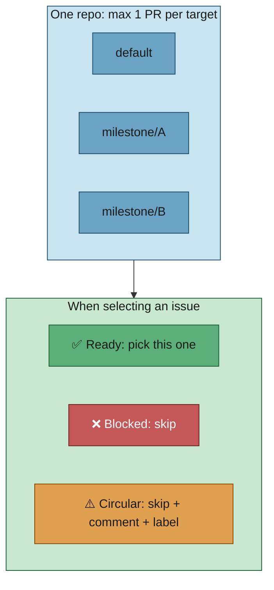
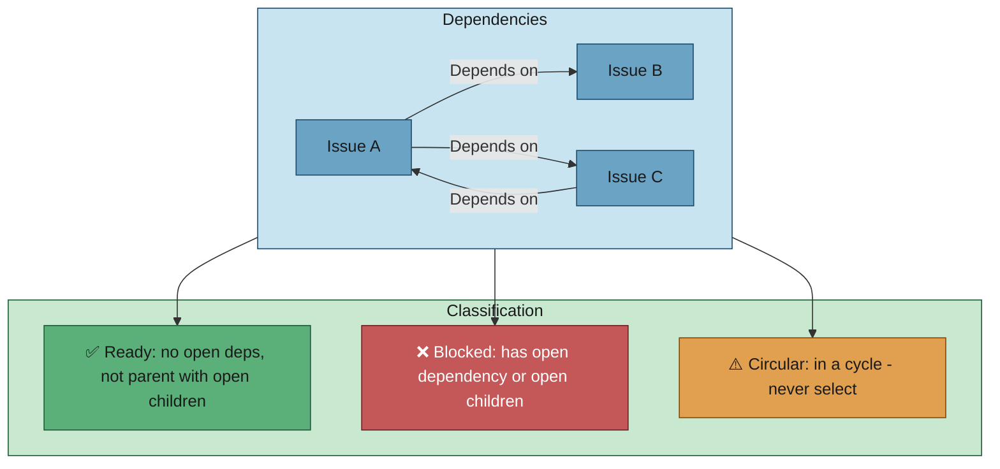
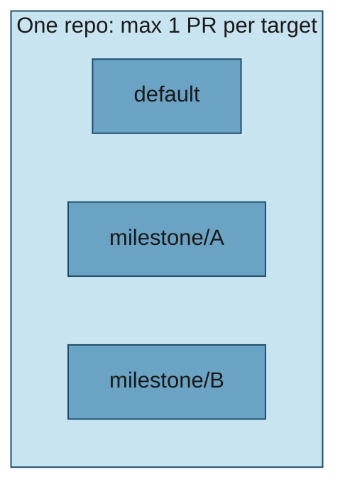
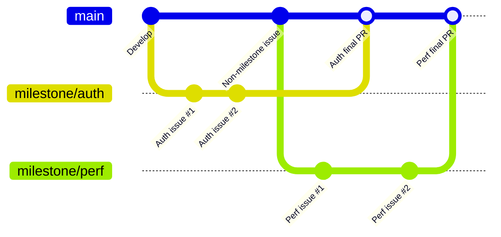

# 🔗 Workflow: Projects and issue dependencies

This page is part of the **user manual** for the Vibe Coder. It describes **milestones as projects**, how issues depend on each other (Depends on, Blocked by, parent/child), and how the appliance honours those relationships — including circular dependencies and branching rules. For internal details, see **Further reading** at the end.

---

## ⚡ TL;DR

**Milestones = projects; dependencies = order.** A **milestone** is a group of issues that share a branch: at most **one PR (Pull Request) per target branch** (default + one per milestone), so more milestones = more concurrent PRs. Issues can **depend** on others (`Depends on `) or be **parents** of sub-issues (task list in body); the worker only picks **ready** issues (deps closed, children closed). **Circular deps** (A→B→C→A): detected, never picked, and **reported** on GitHub with a comment + label so you can fix them. All workflow labels are **auto-created** with consistent colours and descriptions.

---

## 🎯 Purpose and scope

- **Purpose:** Define how the worker treats a set of related issues as a "project" (via milestones), how dependency and parent/child relationships are expressed and honoured, and how corner cases (e.g. circular dependencies) are handled.
- **Scope:** Milestones as projects; "Depends on" / "Blocked by"; parent/child (sub-issues); one PR per target branch; branching off the correct base; deadlock detection and handling. Dependencies are checked via the GitHub API (Application Programming Interface) during issue selection.

## 💡 Concepts

### 🎯 Pseudo-project: milestones

A **milestone** on GitHub acts as a pseudo-project: a group of issues that belong together. The worker:

- Creates one **milestone branch** per milestone (e.g. `milestone/oidc-auth`).
- Allows **at most one open PR per target branch** in a repo. Target branches are: the **default branch** (for issues with no milestone) and **each milestone branch** (for issues in that milestone). So in one repo:
  - Issues with **no milestone** → one PR targeting the default branch at a time.
  - Issues in **milestone A** → one PR targeting `milestone/A` at a time.
  - Issues in **milestone B** → one PR targeting `milestone/B` at a time.
- With no milestones, there is at most one PR (to default). With one milestone, there can be up to two PRs (one to default, one to the milestone branch). With more milestones, more concurrent PRs (one per milestone plus one to default).
- **Enforced at issue selection:** The worker skips any issue whose target branch already has an open PR by the configured GitHub user. This filtering happens at **issue selection** time, not at PR creation. Issues with `ignore-open-prs` (added by an allowed author) bypass this check. See [resilience-and-concurrency.md](resilience-and-concurrency.md#one-pr-per-target-branch-open-pr-blocking).
- **Implementation only:** This constraint applies only to implementation workflows. Planning, question, and refinement workflows are exempt — they never create branches or PRs. See [planning-and-questions.md](planning-and-questions.md#open-pr-blocking-does-not-apply-issue-500).

When **all** issues in a milestone are completed (each milestone-issue PR has auto-merged into the milestone branch — no human review per issue, so the worker can safely run 24/7), the worker raises **one final PR** from the milestone branch to the default branch. **No code reaches the default branch without your review:** that final PR is your single gate. You approve it when ready — many issues completed, all quality gates already run. See [milestones.md](milestones.md).

### 🔗 Issue relationships the worker honours

1. **Forward dependencies ("Depends on" / "Blocked by")**  
   In the issue body, text such as `Depends on ` or `Blocked by ` (and cross-repo forms) declares that this issue must not be worked on until issue is **closed**. The worker skips any issue that has an open dependency.

2. **Parent/child (sub-issues)**  
   A **parent** issue lists **children** (sub-issues) via:
   - GitHub task list syntax in the body (e.g. `- [] `, `- [x] `), or
   - Sub-issues detected via API.  
   The worker does **not** select a parent for implementation until **all** of its child issues are closed. Children can be worked on independently (and in dependency order if they have "Depends on" among themselves).

The worker uses both dependency checking and parent/child checking during issue selection so that only **ready** issues (no open dependencies, and not a parent with open children) are eligible. Dependency and parent/child checks are *suppression filters*: they remove a candidate from its tier but do not change the tier order itself. The overall order — the `top-priority` → `work-on` → `low-priority` → `idle-task` tiers, globally oldest-first within a tier — is documented in [issue-processing.md → Issue selection priority](issue-processing.md#-issue-selection-priority).

## 🌿 Branching rule: milestone issues

- **Issues with no milestone** — Feature branch is created from the **default** branch. PR targets the default branch.
- **Issues in a milestone** — Feature branch is created from the **milestone branch** for that milestone (if it exists; otherwise the worker creates it from default). PR targets the **milestone branch**, not the default branch.

So milestone issues always branch off the milestone branch when present, keeping the milestone branch as the single integration line for that project.

## ⚠️ Corner cases

### 🔄 Circular dependencies (deadlock)

**Example:** A depends on B and C; C depends on A. No issue can become "ready" because each is waiting on another in the cycle.

**Workflow behaviour:**

1. **Detect** — The worker (or supporting logic) builds a dependency graph and detects cycles (e.g. via topological sort / DFS — Depth-First Search). Issues that participate in a cycle are classified as **circular**.
2. **Never select** — Circular issues are **never** considered "ready" and must not be picked for implementation. Selecting one would not resolve the cycle and would block others.
3. **User must break the cycle** — Until a user edits the issues to remove or change a "Depends on" / "Blocked by" so that the cycle is broken, none of the issues in the cycle will be worked on. The worker does not arbitrarily "ignore" one dependency to break the cycle.
4. **Must report** — The worker **must** report circular dependencies on GitHub so users can see and fix them. Machines are unattended; logging alone is not sufficient. For each issue in a detected cycle:
   - **Comment** on the issue explaining that it is part of a circular dependency (list the cycle, e.g. "This issue is in a dependency cycle: #A → #B → #C → #A. Please remove or change a 'Depends on' / 'Blocked by' to break the cycle.").
   - **Apply a dedicated label** (e.g. `circular-dependency` or as configured) so the issue is visible in issue lists and filters. The label must be auto-created with a consistent colour and description (see [Workflow labels](#workflow-labels)).

**Summary:** Detect circular dependencies; never pick circular issues; **always** comment and label so users are informed; require human intervention to fix the dependency graph.

### 🏷️ Workflow labels

All workflow labels (e.g. `failed-once`, `failed`, `needs-human`, `refine-issue`, `planning`, `question`, `needs-screenshot`, `circular-dependency`) must be **automatically created** when first needed, with **consistent colours and descriptions** across repositories. This applies to every label used by the workflow so that repo maintainers do not have to create them by hand and so the meaning is clear. The worker ensures each label exists (create if missing) with the same colour and description as defined in configuration or code.

### 👪 Parent with open children

- Parent is **blocked** until all children are closed. No special case: the parent is simply not eligible until every child issue is closed.

### 🔀 Mixed dependencies and milestones

- Dependencies can cross milestones (e.g. issue in milestone A depends on issue in milestone B). The worker honours the dependency regardless of milestone: the dependent issue is not selected until the dependency is closed.
- The **one PR per target branch** rule is independent: it limits how many concurrent PRs exist per base branch; dependency rules limit which **issue** is selected next.

### 🚫 All issues in a milestone blocked

- If every open issue in a milestone is either blocked by dependencies or is a parent with open children, the worker will not pick any of them. It may pick an issue in another milestone or an issue with no milestone (subject to one PR per target branch). When dependencies are later closed, milestone issues become eligible again.

## 📊 Diagram: dependency and readiness

## 📊 Diagram: one PR per target branch

So: **no milestone** → up to 1 PR (to default). **One milestone** → up to 2 PRs (default + milestone). **N milestones** → up to N+1 PRs.

## 📊 Diagram: parallel milestone branches (gitGraph)

The following `gitGraph` diagram shows how multiple milestones allow parallel work — each milestone has its own branch with independent PRs, while non-milestone issues target `Develop` directly:

*The `main` line represents `Develop`. Each milestone has its own branch with sequential PRs. Non-milestone issues merge directly to `Develop`. Multiple milestones can have work in progress simultaneously — one PR per target branch.*

## 📚 Further reading

- **Internals:** [Worker Internals](../INTERNALS.md) — run loop, issue selection, PR monitoring, milestone/dependency handling.
- **Implementation details:** [worker/deno/lib/issue_dependencies.ts](../../worker/deno/lib/issue_dependencies.ts), [worker/deno/lib/issue_finder.ts](../../worker/deno/lib/issue_finder.ts), [worker/deno/lib/git_branch.ts](../../worker/deno/lib/git_branch.ts).
- **User docs:** [milestones.md](milestones.md), [resilience-and-concurrency.md](resilience-and-concurrency.md), [issue-processing.md](issue-processing.md).
