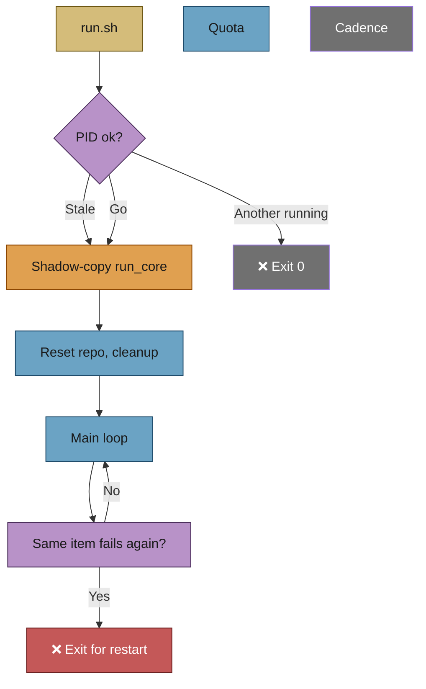
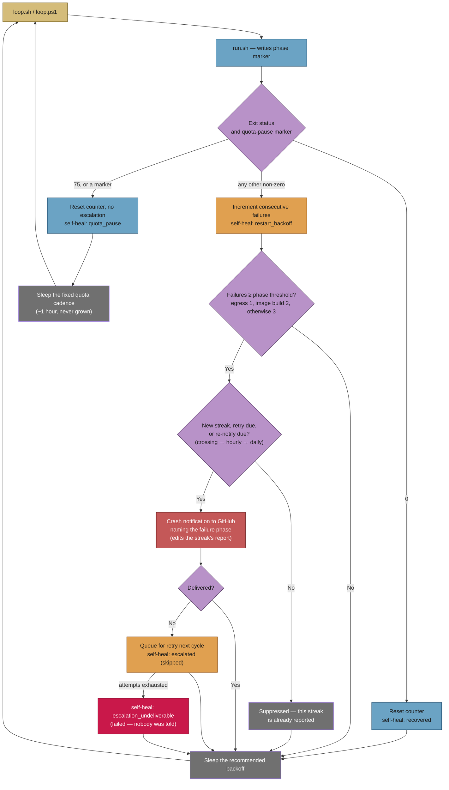
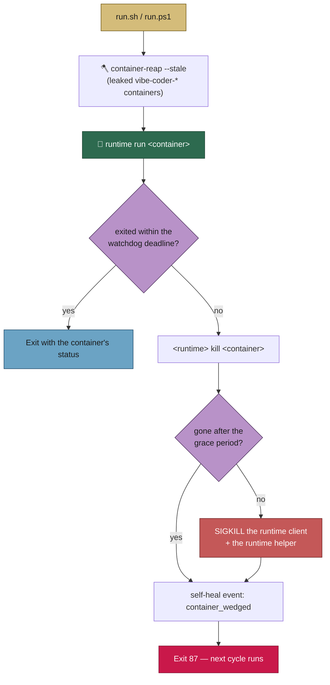
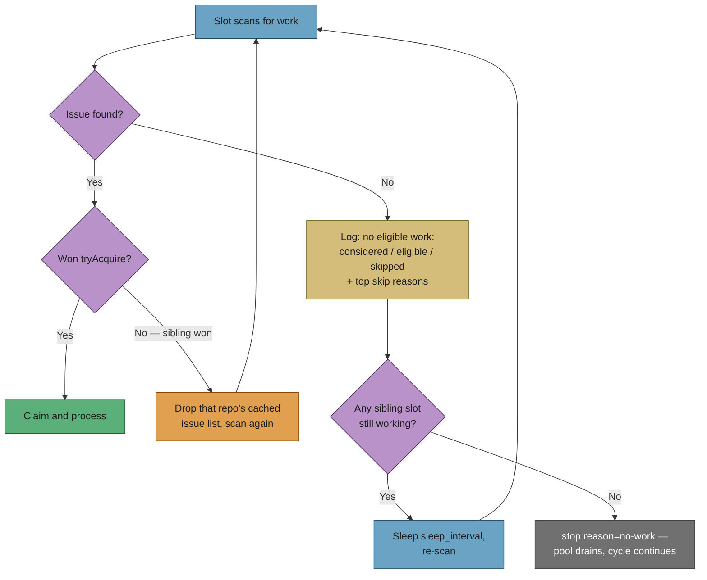
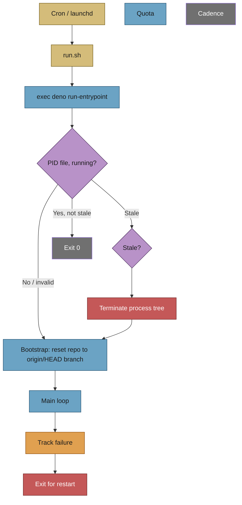
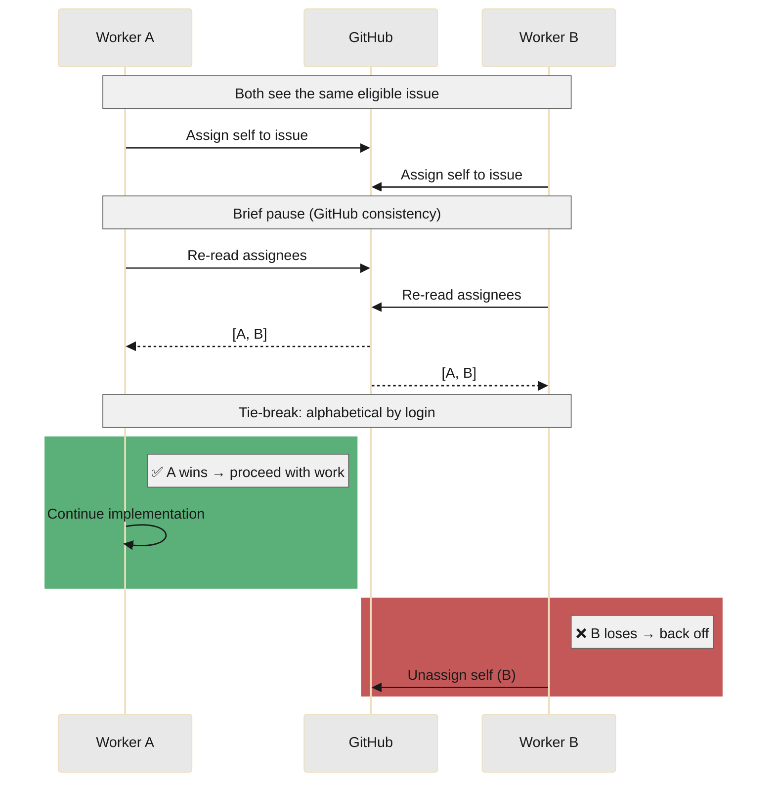

# 🛡️ Workflow: Resilience and concurrency

This page is part of the **user manual** for the Vibe Coder. It describes self-healing, the restart model, issue claiming when multiple workers or humans are active, and how the appliance coexists with others. For internal details, see **Further reading** at the end.

---

## ⚡ TL;DR

**Runs unattended and plays nice with others.** Each run: **PID (Process Identifier) check** (exit if another run is active; kill if stale), **reset repo** to its remote's default branch (`origin/HEAD`; the running Deno driver is immune to its own mid-run reset because it loads its modules at process start — the property the old shadow-copy provided), then the main loop. **Claiming:** assign self to the issue, wait a moment, re-read assignees — if two workers claimed, alphabetical login wins and the other backs off. **One PR (Pull Request) per target branch:** don’t start a new issue for default (or a milestone) if there’s already an open PR for that branch. **Repeated failure** on the same item → exit so cron can restart with fresh code. **Defence in depth:** timeout wrappers on all operations, rate-limit aware retry, persistent failure/circuit-breaker/cooldown state that survives crashes, heartbeat tracking during Claude execution, crash cleanup handlers, orphan issue recovery, and crash notifications via issue comments and webhooks. **Self-assigning phases release their claim on every terminal exit — including failure** — so a stuck issue is freed immediately; **out-of-memory is terminal** (fast fail with a distinct `out_of_memory` diagnostic); **stale-assignment recovery runs every cycle**, not just at start-up; a **per-handler watchdog** stops a hung call freezing the loop; and **repeated failure escalates to a human** via `needs-human`, counted across the whole fleet.

---

## 🎯 Purpose and scope

- **Purpose:** Define how the worker should recover from failures and run safely when multiple workers or humans act on the same repos.
- **Scope:** Process lifecycle (run.sh → Deno `run-entrypoint` driver, PID guard, run duration); repo reset; disk cleanup; temp cleanup; consecutive-failure exit; issue claiming and tie-breaking; open-PR blocking for new issues; milestone-aware blocking.

## 🎭 Actors and triggers

- **Triggers:** Cron or launchd invokes `run.sh` periodically. Each run: `run.sh` `exec`s the Deno `run-entrypoint` driver, which does the PID check, then runs the loop until duration expires or exit (e.g. consecutive failures). Multiple machines may run workers concurrently against the same repos.
- **Actors:** run.sh / run.ps1; the Deno `run-entrypoint` driver (`run_worker.ts`); Deno commands and libraries; other workers (other processes/machines); humans (direct pushes, merges, issue edits).

## 📏 Preconditions / invariants

- **Single process per run:** Only one run_core process per worker repo at a time (PID file; stale PIDs terminated after threshold).
- **Shadow-copy:** run_core is copied before execution so in-progress runs are not affected by git pull.
- **Claim-before-work:** For any issue-based work, the worker claims the issue (assign self, verify, resolve contention) before performing work.
- **Self-heal on repeated failure:** After N consecutive failures on the same work item, the process exits so the scheduler (cron/launchd) can start a fresh process with updated code.

## ✅ Happy path

### 🔄 Process and restart

1. **run.sh** — Bootstrap PATH, locate Deno, and `exec` `deno run … run-entrypoint`. The driver's PID guard: if the PID file exists and its process is the worker driver and not stale, exit (another run active); if stale (age > threshold), terminate the process tree and remove the PID file. No bash script is shadow-copied — Deno loads its modules at process start, so the running driver is already immune to a mid-run `git reset`.
2. **run-entrypoint driver** (`run_worker.ts`) — Claim PID file; bootstrap prelude (PATH, run-id, logging, reset repo to the branch `origin/HEAD` names, software-update); validate config; resolve GitHub user; startup housekeeping (disk/temp/branch sweeps); enter the `run-core` loop.
3. **Loop** — Each iteration: check work queues in priority order; process at most one item; on success reset failure count; on failure track (same item key); if consecutive failures ≥ threshold, exit. Sleep; repeat until run duration expires or exit. Repo scan order is randomised by default (`shuffle_repos`) for fairness — see [issue-processing.md § Repository scan order](issue-processing.md#repository-scan-order-fair-scanning-then-oldest-first). When a cycle ends with no claimable work in any monitored repo, the worker invokes the idle security scanner (gated on a global lock and an idle-cycle counter) before sleeping — see [Security Scans — Operator Manual](../SECURITY-SCAN.md).
4. **Exit** — Cleanup (descendants, temp files, PID file, terminal title, GitHub status); exit. Next cron/launchd run starts a new process.

### 🔁 Container restart backoff and escalation

The container is a disposable execution environment: when it dies, the supervisor re-invokes the launcher and a fresh container is built and started. Two failure modes are handled explicitly:

1. **Restart storms.** `loop.sh` / `loop.ps1` no longer sleep a fixed `LOOP_SLEEP_SECONDS` regardless of outcome. After each launcher invocation they call `deno run … mod.ts container-restart-backoff --exit-status <status>`, which counts consecutive failures in `${WORK_DIR}/.container_restart_state.json` and answers with the seconds to wait — the base sleep doubled per consecutive failure, capped at 30 minutes. A clean run resets the counter. If the recorder cannot run, the supervisor says so on stderr and falls back to the base sleep; it never stops supervising.
2. **A host that cannot heal itself.** `run.sh` / `run.ps1` write the phase they reached (`runtime_detection`, `container_egress`, `image_build`, `volume_init`, `container_run`) to `${VIBE_STATE_DIR:-~/.vibe-coder}/last-launch-phase`, so a failure is attributed to **runtime detection**, **image build**, **work volume preparation**, **container start** (the runtime's own 125/126/127), **container egress** (Issue #997) or the **worker run**. `volume_init` covers the `volume create` and ownership-init `run` between the image and the launch (Issue #710): those are runtime invocations, and attributing them to runtime detection sent operators looking at a phase that had already succeeded. Once consecutive failures reach the phase's threshold — **1** for blocked container egress, because the host cannot repair its own routing however many cycles it spends rediscovering the fault, **2** for a failed image build, because the known-good environment cannot be reconstructed at all, **3** otherwise — the failure is reported through the existing [crash-notification](../../worker/deno/lib/crash_notification.ts) channel (GitHub issue comment on the issue that was in flight, plus the optional webhook).
3. **A host whose containers cannot reach the network** (Issue #997). Before the build, each launcher runs `container-egress-probe`: one short container that opens a TCP connection to a **literal address** (`1.1.1.1:443` by default, `VIBE_EGRESS_PROBE_TARGET` to change it). A name would not do — the container bridge is the host itself, so DNS answers while every packet past the gateway is dropped. The same address is then tried **from the host**, and that comparison is what separates three conditions a 135-second `curl` inside a build could not:

   | container | host | verdict | what the launcher does |
   | --- | --- | --- | --- |
   | reaches it | – | `reachable` | builds and launches as before |
   | blocked | reaches it | `egress_blocked` | writes the `container_egress` phase marker, **parks** (exit 88) without building, and escalates once with the hop table, the host's reject routes and any tunnel interface holding a default route |
   | blocked | blocked | `network_down` | waits: the evidence carries the network-unavailable marker, so the streak does not climb the ladder and nobody is paged (Issue #949) |
   | not run | – | `inconclusive` | launches exactly as before — a probe that cannot run never blocks a host |

   A parked host backs off at the **ceiling** (30 minutes) rather than climbing from the base sleep, and each parked cycle emits a `host_parked` self-heal event naming it as unavailable capacity with the reason `container_egress_blocked` — the worker cannot repair a reject route on the container bridge, so the honest behaviour is to stop burning cycles and say why.

   That event carries the capacity as a number, in the slot-utilisation vocabulary of Issue #925 (`slot-utilisation: host=… slots=2 … unavailable=3600s unavailable_reason=container_egress_blocked`), and the [green-gate report](../CONTAINMENT.md#green-gate-evidence-is-the-fleet-actually-running-contained) for that host leads with `Availability | unavailable — container_egress_blocked`. Four hosts share this configuration, so a parked one is read as capacity the fleet has lost rather than as a machine that went quiet.

4. **An escalation channel that floods, or loses the escalation.** The threshold used to be re-evaluated every cycle, so failures 3, 4, 5 … 54 of one ongoing condition each filed their own report — 59 `escalated` events for a handful of incidents, one streak reporting 54 times — and an escalation the channel rate-limited was dropped with no retry and no record. A streak is now identified by its **phase and its start**, and:
   - it escalates **once, on the threshold crossing**, then re-notifies on a **decaying schedule** — crossing, then hourly, then daily — so a genuinely stuck host stays visible without filling the channel;
   - a re-notification **updates rather than repeats**: the report carries a body marker (`VIBE_CONTAINER_ESCALATION:<phase>:<streak start>`) and the existing comment is edited with the current count, the same marker dedup the script-failure (#207) and idle-inversion (#321) streaks use;
   - a **suppressed escalation is queued and retried** on the next cycle rather than dropped — being rate-limited by GitHub is exactly the state in which a worker most needs to raise its hand. Retries are capped (5 attempts) and then fall back to the re-notify schedule;
   - an escalation still undeliverable at the cap, or whose streak ends before it ever landed — the host recovered, a pause was scheduled, or the fault moved to a different phase — is emitted as an `escalation_undeliverable` self-heal event with result **failed**, and the attempts that were lost are named in the next report that does get through.
5. **A host that is merely out of quota.** Quota exhaustion is neither of the above: the worker stops on purpose, with the reset already known, so backing off exponentially, escalating and rebuilding the container are all wrong answers. The run declares the pause twice — it exits **75** (`QUOTA_PAUSE_EXIT_STATUS`, a status no crash produces), and it writes `~/logs/quota-pause.json`, which crosses the container boundary on the one host mount both sides share. The recorder **consumes** that marker, so it can only ever explain the invocation that just ended: a later run that genuinely crashes while the quota is still out has no marker of its own and backs off exactly as before. A quota pause **resets the failure streak**, escalates nothing, claims no recovery, and re-probes at a **fixed cadence** (`--quota-pause-sleep-seconds`, default 3600 s) — clamped down when the window reopens sooner, never grown — because the quota may be *extended* before its stated reset and a host whose interval doubles every cycle would not notice.

Every action — backoff, recovery, escalation, quota pause — is emitted as a structured self-heal event, so it appears in `self-heal-summary` rather than only in a host log.

Under the canonical cron/launchd/systemd/Task Scheduler model there is no supervising process between runs, so `run.sh` / `run.ps1` record their own outcome on the way out and the same counting and escalation apply — the scheduler's fixed interval is the retry. `loop.sh` / `loop.ps1` set `VIBE_SUPERVISOR_RECORDS_OUTCOME`, which tells the launcher to leave the recording to them: one failure is counted once, never twice.

**Every outcome record must be able to name its host and its cause.** The escalation is titled `Vibe Coder launcher failing on <host> (<phase>)`, and that title is also its deduplication key — so a recorder that cannot read `Deno.hostname()` files every host in the fleet under one `unknown-host` issue per phase, traceable to no machine. Deno refuses that read without `--allow-sys=hostname`, so **all four** call sites (`run.sh`, `run.ps1`, `loop.sh`, `loop.ps1`) pass it; `findOutcomeRecordInvocations` ([`outcome_record_gate.ts`](../../worker/deno/lib/outcome_record_gate.ts)) is the gate that keeps them in step. Alongside it, `--launch-log <path>` gives the report the failing run's own output: `loop.sh` passes that cycle's launch log, and `run.sh` / `run.ps1` pass the failed build's log or the container capture (below) — an escalation that cannot say *why* the step failed is a report nobody can act on, which is what Issues #709, #710, #711, #720 and #1029 were. A launch that succeeded is never quoted, and the launcher deletes its build log only **after** the outcome has been recorded.

**A launch that failed quotes what the container said (Issues #711, #720, #1029).** Both launchers stream the `run` client's stderr to the console *and* keep a copy, and any launch that started a container and did not exit 0 hands that copy over as `--launch-log`. For a start the runtime refused — exit **125**, **126** or **127**, the statuses that become a `container_start` escalation — the copy carries the client's own refusal. For every other non-zero status it carries the worker's own error lines, which is what a `worker_run` escalation is about: exit **1** *is* the worker reporting its bootstrap, config, credential or loop failure. Withholding the copy for those statuses is what left Issues #994, #995, #996 and #1029 naming a phase and a status and nothing else, and it also disabled the network-unavailable suppression below, because the recorder reads that marker out of the log it is handed. A launch that exited 0 is never quoted: there is no failure for its output to be the evidence of.

Each launcher copies the stream the way its host can. `run.sh` tees through a FIFO rather than a pipeline, because the watchdog reaps by PID and a pipeline would put `tee`'s PID there instead of the client's. `run.ps1` pumps the redirected stream in bounded slices from the thread that waits on the client: `Register-ObjectEvent` handlers do not run while the runspace is blocked in `WaitForExit`, so an event-based tee would hold the container's output back until the run ended, and `ReadToEnd` would deadlock a long run outright — pumping *is* the wait, so the output stays live and the watchdog deadline stays enforced. A host where neither launcher can open its capture launches anyway and says so on stderr: a missing capture costs the report its cause, never the run.

### 🪓 Wedged container watchdog

Backoff only helps once the launcher returns. On host-23 it never did: a worker container's VM stopped answering mid-run, the worker's own run-duration timer never fired, and the host-side `container run` client waited on the dead VM for ever — so `run.sh` never returned and `loop.sh` sat blocked for three hours, leaking a 1 GB VM. `container stop`, `container kill`, `container kill --signal KILL` and an apiserver restart all refused the record ("running and can not be deleted"); only a SIGKILL of the host-side `container run` and `container-runtime-linux` processes cleared it. Two layers make that automatic:

1. **Outer watchdog (primary).** The launch plan carries a `watchdog` deadline — the worker's own maximum run duration plus a 10-minute margin, `VIBE_CONTAINER_WATCHDOG_SECONDS` to override — and both launchers wait on the runtime client under it instead of for ever. On expiry `deno run … mod.ts container-reap --name <container> --client-pid <pid>` runs `<runtime> kill` first and, if the container is still there after a 30-second grace (`VIBE_CONTAINER_REAP_GRACE_SECONDS`), SIGKILLs the runtime client and every host process whose argv carries the container name. The launcher then exits **87** — a named reason, outside the runtime CLI's own 125/126/127 range — so the supervisor backs off and the next cycle runs: "wedged for ever" becomes "one lost cycle".
2. **Pre-launch reaper (belt and braces).** Before each launch the same command runs with `--stale`, reaping every `vibe-coder-*` container older than the deadline, or with no live launcher process behind it — which is also how a wedge that outlived a host reboot is caught. It runs before the image build, so a leaked VM is not still holding the host's memory through it.

Every forced reap is emitted as a `container_wedged` self-heal event, so `self-heal-summary` surfaces a chronically wedging host instead of losing it in a local log. Diagnosing the VM wedge itself is out of scope — the fleet survives it either way.

### 🤝 Claiming under concurrency

1. **Assign** — Worker assigns itself to the issue via GitHub API.
2. **Wait** — Brief sleep (e.g. 2s) for GitHub eventual consistency.
3. **Verify** — Re-read issue assignees.
4. **Single assignee (self):** Claim success; proceed.
5. **Multiple assignees:** Contested; alphabetical tie-break on assignee logins; winner keeps claim; losers unassign themselves and skip.

### 🕵️ An idle pool slot states why — and keeps looking

A slot that found no work used to `return` without writing a single line. In
the hour after `s1` claimed GRQ#4202 (Issue #219), `s2` logged **nothing** while
a dozen eligible `top-priority` issues waited: a two-slot pool ran as one and
the log could not say so. Three behaviours close that hole:

- **Every slot exit names its reason.** `no eligible work`, `deadline`,
  `shutdown`, `drain`, `exit`, `find-error` — each is written at INFO with the
  `[sN]` prefix, so an idle slot is distinguishable from a working one by
  reading the log alone.
- **An empty scan is quantified.** The `no eligible work:` line carries
  `considered=N eligible=N skipped=N top-skips=reason=count,…`, taken from the
  scan's own diagnostic counts. Those counts now ride the scan result, so they
  are visible **without** `ISSUE_FINDER_DEBUG` (which is off in production).
- **A slot that finds nothing re-scans.** While a sibling slot still holds
  work, the empty slot sleeps `sleep_interval` and scans again, so work that
  becomes claimable mid-cycle is picked up within one interval. Only when *no*
  sibling is running does the slot retire — that is the pool draining so the
  cycle's maintenance ladder can run, and it says so (`stop reason=no-work`).

A slot that loses the `tryAcquire` race also drops the winning repository's
cached issue list before scanning again, so the next scan cannot be served the
same ranking that just lost from the 600 s cache.

**Implementation:** `runSlot` in
[run_core.ts](../../worker/deno/lib/run_core.ts), `formatScanSummary` in
[issue_finder_logger.ts](../../worker/deno/lib/issue_finder_logger.ts).

### 🔍 Milestone-aware repo availability (multi-worker contention)

When multiple workers share the same GitHub username, the worker prefers repos with no assigned issues to avoid contention. However, this preference is **milestone-aware**: a repo is only considered "fully busy" when **every work stream** (each milestone plus non-milestone) has assigned work. If only the non-milestone stream is occupied (e.g. a stuck PR targeting the default branch), milestone issues in the same repo remain eligible. This prevents a single stuck default-branch PR from blocking all milestone work. See [milestones.md](milestones.md#milestone-aware-repo-availability) for details.

### 🔀 One PR per target branch (open-PR blocking)

- In each repo, issues target either the **default branch** (no milestone) or a **milestone branch**. The worker maintains **at most one open PR per target branch**: one PR to default (for non-milestone issues) and one PR per milestone (for issues in that milestone). So: no milestone + one milestone = up to 2 PRs; more milestones = more concurrent PRs.
- When selecting an issue for **implementation**, the worker skips an issue if its target branch already has an open PR by the configured GitHub user (default branch or that milestone’s branch). This is enforced at **issue selection** time. (The same user may be shared by many Vibe Coders, one per hostname; PRs are identified by author.) Issues with `ignore-open-prs` (added by an allowed author) bypass this check for any target branch (default or milestone). See [projects-and-dependencies.md](projects-and-dependencies.md) and [milestones.md](milestones.md).
- **Non-implementation workflows are exempt:** Planning, question, and refinement finders do not check for open PRs. These workflows only interact with the issue itself (comments, labels, sub-issues) and never create branches or PRs, so the constraint is irrelevant. See [planning-and-questions.md](planning-and-questions.md#open-pr-blocking-does-not-apply-issue-500).

## 📊 Diagram: self-healing and restart

## 📊 Diagram: concurrent claim

When two workers claim the same issue, both assign themselves; after a short pause they re-read assignees. If both are present, **alphabetical login wins** and the other unassigns and skips. No user action needed.

*If the diagram is hard to read in dark mode, try light mode or view the file on GitHub.*

## 🔀 Decision points and exceptions

- **Git reset fails (e.g. network):** run_core exits with failure; do not run on stale code.
- **Disk above threshold:** Delete and recreate WORK_DIR; then continue.
- **Consecutive failure threshold reached:** Exit so external scheduler restarts; do not loop forever on same failing item.
- **Claim lost:** Log and skip; do not retry same issue this run.
- **Issue cooldown:** After an issue fails, it is skipped for `issue_retry_cooldown` seconds (default 600 = 10 minutes). This prevents the worker from immediately re-picking a failing issue, allowing it to process other issues in the meantime. The cooldown is per-issue, file-based (bash 3.2 compatible), and persisted to disk so it survives restarts.
- **Already-complete detection:** When Claude produces zero output (no code changes), the worker runs a short follow-up prompt asking Claude if the issue is already complete in the codebase. If confirmed, the issue is auto-closed. This handles cases where work was done via a different PR or branch but the original issue was never linked/closed.
- **Remote branch recovery:** When no local changes exist but the remote feature branch has commits from a prior attempt (e.g., worker crashed after push), the worker fast-forwards and creates the PR instead of failing.
- **Timeout wrappers:** All GitHub CLI and git operations are wrapped with configurable timeouts (60s default, 120s for merge/rebase). A hung network call can't block the worker indefinitely — it times out, logs the failure distinctly, and moves on.
- **Rate-limit aware retry:** When the worker hits an HTTP 429, it reads the `Retry-After` header and sleeps for exactly the right duration. A distinct exit code (223) signals rate-limit exhaustion so callers can back off intelligently rather than burning retries.
- **Pre-Claude validation:** Before invoking Claude (and spending credits), the worker validates that the repository is in a clean state — no uncommitted changes, no detached HEAD, no divergence from remote. Catches problems early and cheaply.
- **Heartbeat during Claude execution:** Background heartbeat updates run while Claude is working, so stuck-issue detection can react within minutes rather than waiting for the full timeout (default 2 hours).
- **Idempotent PR creation:** Before creating a PR, the worker checks for existing PRs on the same branch. If a duplicate is found (e.g., from a retry after a partial failure), the existing PR is reused rather than creating a confusing second PR.
- **Crash window fix:** The heartbeat is now recorded immediately after claiming an issue (not after setup), and a trap handler runs on unexpected exit to unassign the worker and remove heartbeat files. This closes the window where a crash between claim and first heartbeat would leave an issue permanently orphaned.
- **Orphan recovery:** The stuck issue detector now also checks for issues assigned to the worker with no heartbeat file at all — a scenario that arises when the worker crashes between claiming and recording its first heartbeat. After a 30-minute grace period, these orphans are unassigned and made available for retry.
- **Persistent failure state:** Failure counts, circuit breaker state, and cooldown timers are saved to disk (`.failure_state`, `.circuit_breaker_state`, `.cooldown_state`). State survives crashes and expires automatically (1 hour default). This prevents crash-restart loops where the worker forgets its failure history and blindly retries the same failing work.
- **Crash notifications:** When the worker exits unexpectedly, it posts a comment on the GitHub issue it was working on and optionally fires a webhook (`CRASH_WEBHOOK_URL`) for integration with Slack, PagerDuty, etc. Rate-limited (600s default) to prevent notification spam during rapid crash-restart loops. Enhanced (751) with: **worker log tail** (last 100 lines with key errors highlighted), **Claude output tail** (last 100 lines in a collapsible section), **work stage** (which phase was in progress — e.g., `running_claude`, `running_quality_checks`), **elapsed time** (how long the work had been running), and **system context** (uptime, disk free, memory pressure).
- **Pre-flight quality baseline:** Before making changes, the worker runs `./quality.sh` on the clean repo to establish a baseline. Failure comments then distinguish pre-existing issues from worker-introduced regressions, reducing false blame on the worker.
- **PR blocking alerts:** When open PRs block all eligible issues in a repository for longer than `REPO_BLOCKED_ALERT_HOURS` (default 24), the worker posts a warning comment on the blocking PR(s). The alert suggests merging, closing, or adding the `ignore-open-prs` label. Milestone-merge PRs are excluded from blocking.
- **Periodic health checks with caching:** Health checks (Claude CLI and GitHub authentication) are cached for a configurable TTL (Time To Live, default 300 seconds = 5 minutes) to avoid repeated expensive checks during scan cycles. Cache files (`.health_cache_claude`, `.health_cache_gh_auth`) are stored in `WORK_DIR` and automatically invalidated after failures. Configurable via `HEALTH_CHECK_CACHE_TTL`.
- **Claude authentication detection:** If the Claude CLI (Command Line Interface) session has expired, the worker detects it immediately and exits with a clear, actionable error message ("run `claude login`") instead of failing cryptically.
- **Combined claim + heartbeat comment:** The first claim comment and the first heartbeat comment are merged into a single comment on the issue, replacing the previous pattern where the worker posted two separate comments seconds apart. This reduces notification noise and trims one GitHub API call per issue.
- **Push gated on git state, not Claude stdout:** When deciding whether to push and reply on a PR-feedback iteration, the worker now consults the local git state (`git status`, `git log origin/<branch>..HEAD`) instead of trying to parse Claude's stdout. This eliminates a class of "forgotten push" bugs where Claude reported success but the worker never pushed because the textual marker did not match.
- **Self-healing duplicate-PR race:** When an external PR closes the issue while the worker is preparing its own PR, the worker now detects the merged-and-closed state during the recovery path, abandons its branch cleanly, and posts a comment instead of failing the run.
- **Pre-flight merged-PR check:** Phase 0 of issue processing checks whether a PR that already closes the issue has been merged. If so, the issue is closed and the worker moves on without ever invoking Claude.
- **Release the claim on terminal failure:** The self-assigning phase processors (grill-me, clarity, planning, refinement, question, revision) hand the ball back to the developer when they finish — and they let go of the issue on **every** terminal exit: success, label hand-off, *and* terminal failure. So even when a phase fails, the worker unassigns itself (best-effort, after posting its failure marker) rather than leaving the issue stuck on a worker with no live heartbeat. A freed issue can be picked up immediately by the next worker, and the assigned-without-heartbeat recovery (below) stays quiet instead of posting a spurious "Automatic recovery" comment ~30 minutes later. All processors route their terminal paths through one shared `releaseClaim` helper, extended to the full set in. See the **Release the claim on terminal failure** entry in [DESIGN-PRINCIPLES.md](../../DESIGN-PRINCIPLES.md) and [Worker Internals](../INTERNALS.md) for the implementation.
- **Out of memory is terminal:** If Claude exhausts memory (a V8 heap-exhaustion / OOM), the worker treats it as a **terminal** failure — it errors out fast rather than pausing or retrying, because waiting cannot reclaim memory. The failure is surfaced with its own distinct `out_of_memory` diagnostic (never mislabelled as a timeout or rate-limit pause), so an operator can tell at a glance that the run ran out of memory and should reduce issue scope or get more host memory. A run that already pushed a PR before the OOM is still credited as self-healed. See [Worker Internals → Out-of-memory is terminal](../INTERNALS.md) for detail.
- **Per-cycle stale-assignment recovery:** The GitHub-side recovery scans — which detect issues assigned to the worker with no live heartbeat and free them for retry — run on **every** scan cycle, not just at start-up. So a leaked assignment is recovered within a cycle rather than waiting for a worker restart, and a just-freed issue is available to the same cycle's new-work scan. The scan reuses the per-iteration issue cache, so a quiet cycle costs no extra GitHub API calls and adds no log noise when it recovers nothing. See the **Per-cycle stale-assignment recovery** entry in [DESIGN-PRINCIPLES.md](../../DESIGN-PRINCIPLES.md).
- **Per-handler dispatch watchdog:** Each maintenance handler in the main loop (PR feedback, CI fixes, revisions, etc.) is bounded by a watchdog so a hung `gh` or network call can't freeze the whole loop and stall the fleet. A hard timeout (default 600 seconds) abandons a wedged handler, logs a `[watchdog]` line naming the priority and handler, and advances to the next item; a soft warning (default 120 seconds) keeps slow-but-not-stuck handlers visible in the logs. A handler that keeps working after its agent returns gets a **floor** instead of that flat 600 seconds — the agent's own timeout plus an allowance for the tail — so planning is never abandoned mid-repair just because it started late in a cycle (planning: 1800 s agent + 600 s gate/repair tail = 2400 s). A handler that fails for an ordinary reason (e.g. a rate limit) propagates as before — the watchdog only catches genuine hangs. See the **Per-handler dispatch watchdog** entry in [DESIGN-PRINCIPLES.md](../../DESIGN-PRINCIPLES.md).
- **Consecutive-failure escalation to humans:** When the same work item keeps failing, the worker eventually stops re-claiming it and escalates by applying the `needs-human` label (with an explanatory comment) so a person can take a look. The failure count is tallied across **all** worker identities, so the escalation still fires when several workers in a fleet take turns failing the same item — no single worker has to hit the threshold alone. This is the loop's terminating backstop: combined with releasing the claim on failure (above), a stuck item is freed for retry and, if it keeps failing, handed to a human rather than retried forever.

## 📚 Further reading

- **Internals:** [Worker Internals](../INTERNALS.md) — run loop, issue selection, PR monitoring, milestone/dependency handling.
- **Implementation details:** [run.sh](../../run.sh), [worker/deno/lib/run_worker.ts](../../worker/deno/lib/run_worker.ts), [worker/deno/lib/pid_guard.ts](../../worker/deno/lib/pid_guard.ts), [worker/deno/lib/claim_issue.ts](../../worker/deno/lib/claim_issue.ts), [worker/deno/lib/failure_tracker.ts](../../worker/deno/lib/failure_tracker.ts), [worker/deno/lib/circuit_breaker.ts](../../worker/deno/lib/circuit_breaker.ts), [worker/deno/lib/cooldown_state.ts](../../worker/deno/lib/cooldown_state.ts), [worker/deno/lib/disk_space.ts](../../worker/deno/lib/disk_space.ts), [worker/deno/lib/issue_finder.ts](../../worker/deno/lib/issue_finder.ts), [worker/deno/lib/stuck_issue_detector.ts](../../worker/deno/lib/stuck_issue_detector.ts), [worker/deno/lib/crash_cleanup.ts](../../worker/deno/lib/crash_cleanup.ts), [worker/deno/lib/crash_notification.ts](../../worker/deno/lib/crash_notification.ts), [worker/deno/lib/health_check_cache.ts](../../worker/deno/lib/health_check_cache.ts), [worker/deno/lib/git_timeout.ts](../../worker/deno/lib/git_timeout.ts), [worker/deno/lib/gh_wrapper.ts](../../worker/deno/lib/gh_wrapper.ts), [worker/deno/lib/claude_auth.ts](../../worker/deno/lib/claude_auth.ts), [worker/deno/lib/repo_blocked_alert.ts](../../worker/deno/lib/repo_blocked_alert.ts), [worker/deno/lib/quality_helpers.ts](../../worker/deno/lib/quality_helpers.ts), [worker/deno/commands/diagnose_repo.ts](../../worker/deno/commands/diagnose_repo.ts), [worker/deno/lib/claim_release.ts](../../worker/deno/lib/claim_release.ts), [worker/deno/lib/handler_watchdog.ts](../../worker/deno/lib/handler_watchdog.ts), [worker/deno/lib/claude_executor.ts](../../worker/deno/lib/claude_executor.ts).
- **User docs:** [README.md](../../README.md), [DEPLOYMENT.md](../DEPLOYMENT.md), [issue-processing.md](issue-processing.md), [milestones.md](milestones.md).
