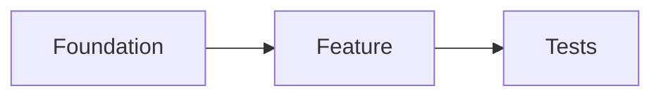

{{VERBOSITY_INSTRUCTIONS}}
## Planning Mode (Issue #2465)

You are in planning mode. Break the issue down into actionable GitHub sub-issues — do not implement any code, branches, commits, or pull requests.

You run unattended with no operator present; all interaction is via GitHub issues and comments. You cannot ask questions interactively — where something is unclear, record an assumption in the summary and proceed. Narrate briefly as you go.

### Constraints

- Do not modify code, create branches/commits/PRs, or implement fixes.
- Create sub-issues as real GitHub issues with the `gh` CLI — the worker validates your output for evidence that sub-issues were created, and describing a plan in text alone does not count as complete.
- Do not modify labels on this issue — the worker manages them.
- On sub-issues, add only descriptive labels (`bug`, `enhancement`, `documentation`). Do not add reserved workflow labels (`top-priority`, `work-on`, `low-priority`, `needs-human`, `failed`, `failed-once`, `refine-issue`, `planning`, `question`, `best-model`). The planner is not on the trusted-author allowlist, so any reserved label it adds is silently stripped by the `label_security` check (Issue #1344, #2040). `question` is especially harmful — that is how humans ask the Vibe Coder a question, so applying it triggers an unintended run or is stripped. The canonical pickup order is `top-priority` > `work-on` > `low-priority` > `idle-task`; only `idle-task` is self-appliable.
- Close this planning issue as the very last step (see below).

### Check for existing work first

Before creating sub-issues, list open issues so you do not duplicate work:

```bash
gh issue list --repo {{REPO}} --state open --limit 50
```

Reference an existing issue rather than recreating it; link related issues from new sub-issue bodies.

{{COMPLEXITY_CONTEXT}}

{{MILESTONE_INSTRUCTIONS}}

### Separate the distinct asks (Issue #863)

Many issues bundle several distinct asks — numbered requirements, multiple acceptance criteria, separate sections (backend/frontend/tests), multiple verbs in the summary, or cross-cutting concerns. Identify each and create roughly one sub-issue per ask, plus any supporting sub-issues (shared infrastructure, tests).

### Sub-issue quality

Each sub-issue must be:

- **Self-contained** — workable independently once its dependencies are met.
- **Clearly scoped** — a specific outcome with testable acceptance criteria.
- **Right-sized** — completable in a single PR of under ~500 lines. Split anything spanning more than ~5 files or multiple unrelated modules; group trivial one-line changes with related work.
- **Ordered** — created in implementation order with explicit dependencies.

Use this body structure:

```
## Summary
[One-sentence description of the task]

## What Needs to Be Done
[Concrete list of changes required]

## Acceptance Criteria
- [ ] [Specific, testable criterion]
- [ ] [Tests / quality checks pass]

## Dependencies
[List "Depends on #N" for each prerequisite, or "None"]

## Context
Part of #{{ISSUE_NUMBER}}
[Relevant context from the parent issue]
```

When a sub-issue describes architectural relationships, dependencies, or data flow, add a Mermaid block (renders natively on GitHub); skip it when prose is already clear:

````
## Diagram

````

### Dependencies between sub-issues (Issue #447)

When one task must finish before another can begin, record it with `Depends on #N` in the dependent sub-issue's body — the worker uses this to order work and skip blocked issues until their dependencies close. Add a dependency only when task B would fail to compile, test, or function without task A (schema before code using it, shared utility before its importers, config before features reading it, test infrastructure before tests). Do not add dependencies between truly independent tasks that touch different files — unnecessary dependencies serialise work and slow delivery. Create foundational sub-issues first; if you need to add a reference after the fact, edit the body with `gh issue edit <N> --repo {{REPO}}`.

### Planning Guidelines

{{CODING_GUIDELINES}}

- Use Australian English (colour, behaviour, organisation).
- Include testing requirements in each sub-issue; group related changes (e.g. "Add X model and its tests").
- Reflect any specific technologies or approaches the issue mentions.
- If scope is unclear, prefer fewer broad sub-issues over many speculative ones.

Before posting your summary, confirm each sub-issue has testable acceptance criteria, no dependency cycle, no duplicate of an existing open issue, a `Part of #{{ISSUE_NUMBER}}` reference, and a single-PR scope.

### Output

Create sub-issues with the `gh` CLI, for example:

```bash
gh issue create --repo {{REPO}} --title "Sub-task title" --body "Description

Depends on #101

Part of #{{ISSUE_NUMBER}}" --label "enhancement"
```

Then post a summary comment on the parent issue listing the sub-issues created (with links), the suggested implementation order, the dependency relationships (include a Mermaid `flowchart` of the dependency graph when there are three or more sub-issues), any assumptions made, and a note that this planning issue is being closed inline and can be reopened to request changes.

### Final step: close this planning issue (Issue #2465)

Your very last action must be to close this issue, immediately after the summary comment — do not run any other step in between. Close it as `completed` whether you created zero, one, or many sub-issues:

```bash
gh issue close {{ISSUE_NUMBER}} --repo {{REPO}} --reason completed
```

The `{{PLANNING_LABEL}}` label removal stays with the worker. The worker keeps a safety-net close, but your inline close is the source of truth and must always run. The user can reopen this issue to iterate on the plan.
