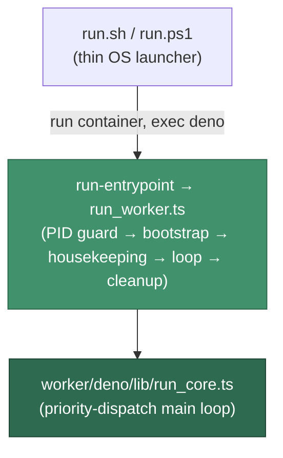

# Worker runtime — the Deno migration

The Vibe Coder worker's runtime path is Deno end to end. All orchestration lives
under [`worker/deno/`](deno/); the thin per-OS launchers (`run.sh`, `run.ps1`)
start the worker container, whose entrypoint `exec`s Deno with no bash on the
runtime path. This note
documents the runtime split and the residual bash files that the milestone
 still retires.

## Current split — the whole runtime path is Deno

The runtime path is bash-free. `run.sh` / `run.ps1` launch the worker
container, whose entrypoint `exec`s Deno
on the `run-entrypoint` command, whose driver
([`worker/deno/lib/run_worker.ts`](deno/lib/run_worker.ts)) owns the whole run —
PID guard, bootstrap prelude, startup housekeeping, and the
priority-dispatch **main loop** via the `run-core` command. The bash
`worker/run_core.sh` conductor and its `worker/.run_core.sh` shadow-copy were
deleted.

## Residual bash surface — no longer on the runtime path

The files below are **no longer sourced by any runtime process** now that
`run_core.sh` is gone; they are retired by the follow-up.

`worker/issue_worker.sh` was deleted in: a 1,973-line driver that
`eval`ed config-derived strings and ran `sh -c` inside a `--network host`
container was still shipped and `git pull`-refreshed onto every worker host
with nothing sourcing it, and it attracted neither runtime testing nor review
pressure.

| File                               | Role                                                                                                                                        |
| ---------------------------------- | ------------------------------------------------------------------------------------------------------------------------------------------- |
| `worker/shared/deno_bridge.sh`     | Bash↔Deno bridge providing `deno_run_command`; still used by ops tooling such as `quality.sh`.                                             |
| `worker/shared/config_defaults.sh` | Compatibility shim for default values; canonical defaults live in `worker/deno/lib/config_defaults.ts`. |

Issue execution (`work_on_issue`, `process_issue_*`) runs in Deno via
`worker/deno/lib/run_core_production_deps.ts` → `issue_worker.ts` /
`planning_processor.ts` / `question_processor.ts` / `refinement_processor.ts`.
